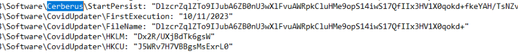

This writeup will walk through a dynamic malware analysis lab of `Pandemic` on [blueteamlabs](https://blueteamlabs.online/).

**Scenario text:** *The second wave of the pandemic started. Cybercriminals also started their second wave of attacks. Here comes the new phishing technique: Alert! Alert! Alert! There are Masks to safeguard yourself from the Pandemic, but do you have a Mask on your PC??? Our OS Vendor released a new PandemicSavior Updater which will act as a Mask to safeguard yourself from the Pandemic. Immediately download the attachment and Run the Update!!! Quick !!! As a malware analyst, your IR team approached you to decide whether the attachment is safe or not. If it’s not safe, provide the IoC’s. Malware sample and the necessary toolkit is available on the Desktop*

## Initial Analysis

After dropping the sample in PE-View we can tell that it's a Delphi binary and packed with UPX. We can tell from seeing `DVCLAL` (Delphi Visual Component Library Access License) in RCDATA and the compiler timestamp in the IMAGE_FILE_HEADER (the timestamp is a well-known bug in Delphi 4-2006). We see that the sample has a large resource labeled `CERBERUS` as well as an resource labeled `A02`. `Answer 2: 19/06/1992, UPX`.

Making a copy of the sample in the directory and then dragging the copy to the desktop results in Defender quarantining the sample, labeling it as `Worm:Win32/Rebhip.V`. We can grab a hash of the sample with `Get-FileHash pandemichero.exe` in PowerShell and then search that on virustotal. Based on the results found on VT and finding 'Cerberus' a few times in PE View, we can make a good guess that this is 'Cerberus RAT' (an older sample that was active from around the 2008-2010 time period (*not to be confused with the popular APK banking trojan also named Cerberus*)). `Answer 10: Cerberus`.

**Sample hash: C4C83313F96E8D8C50F02249289DE652A2F757BD3012153DD26086463187C194**

If we throw the sample in Resource Hacker and take a look at the icons, we can see the text `Answer 1: Covid Mask`. 

## Dynamic Analysis

Running strings over the sample resulted in nothing interesting, so let's go ahead and run the sample. Before doing this, we should use `RegShot` and run an initial snapshot of the registry, as well as open up `Process Explorer` and `Procmon`. Once the first registry snapshot runs, go ahead and execute the sample. Upon execution a message box pops up with: `Answer 4: "Congratulations Pandemic Hero!, You took the step to protect your PC with this Mask"`.

Watching the chain of execution in Process Explorer, we can see that the sample injects into `Answer 9: Internet Explorer`, which then shell executes `C:\Windows\touchmeagain.bat`. After adjusting file explorer view settings (disable all hides, enable show), we can see that the content of the batch script is a netcat command, with the verbose flag and IP/port: `Answer 3: 172.16.104.128, 445`.

Viewing network activity in Process Explorer, we see the Internet Explorer process attempting to make connections to `Answer 8: box5210.bluehost.com - 162.241.224.203:5150` every 10 seconds or so, which we can guess would be the server address. Taking a look at few other details of the running Internet Explorer process and we see a few unique mutexes (`Covid` and `Covid_Persist`). The other mutant that is interesting is `RasPbFile`, which I belive dates this sample back a handful of years (Microsoft RAS (Remote Access Service) has to do with the 'Dial-Up Networking Monitor' property sheet and other dialog boxes for managing or dialing phone book entries).

## Reviewing Log Captures

Let's now run a second snapshot of the registry with RegShot, and once that's done, compare. Noticeable in the comparison of changes made in the registry are some values created under HKEY_CURRENT_USER\Software (these appear to be encrypted or encoded). Then for boot/logon persistence ([T1547.014](https://attack.mitre.org/techniques/T1547/014/) and [T1547.001](https://attack.mitre.org/techniques/T1547/001/)) there are `ASEP` (AutoStart Extenion Points)/RunKeys created in the HKEY_LOCAL_MACHINE and HKEY_CURRENT_USER hives with a stub path pointing to `Answer 6: ImportantUpdate.exe`. An active setup component in HKEY_LOCAL_MACHINE\SOFTWARE\WOW6432Node with the GUID and stub path of the 'update' binary (`ImportantUpdate.exe`) is also created. `Answer 7: ImportantUpdate`. The directory at `C:\Program Files (x86)\MSUpdate` is where this copied loader is stored in a hidden state. 

*Under HKEY_CURRENT_USER\Software\CovidUpdater and HKEY_CURRENT_USER\Software\Cerberus:*

*ASEP/Run keys under HKLM and HKCU*

*Active setup component:*

**HKLM\SOFTWARE\WOW6432Node\Microsoft\Active Setup\Installed Components\/{T5TBB77L-4678-0MKC-421Q-14416031DYU6}\StubPath: "C:\Program Files (x86)\MSUpdate\ImportantUpdate.exe Restart"**

Looking through the Procmon log capture, we can see the server querying for some interesting files (`PleaseStop.spy` and `plugin.dat` are queried for and not found). We can aslo see that it drops a keylog data file named `Answer 5: footprint.dat` in the same `MSUpdate` directory as the loader copy.

*Confirming footprint.dat is the keylog file:*

With this we have reached the end of this analysis lab!

