In this post, I will be going deeper on the sample used in my previous BTLO challenge writeup. The challenge sample `Cerberus RAT 1.03.5 Beta 2009` surfaced around the same time that early `Spy-Net RAT` versions came out and heavily mirrors Spy-Net RAT's functionality. More well known RATs spawned from these early Spy-Net/Cerberus code bases with examples being `CyberGate Excel ('Rebhip')` and `Xtreme RAT` (more info [here](https://www.reversinglabs.com/blog/spying-on-spynet)).

## Initial Analysis

*Helpful tools used for setting up analysis on Delphi binaries:*
- [IDR](https://github.com/crypto2011/IDR)(Interactive Delphi Reconstructor) - based off of (http://hmelnov.icc.ru/DCU/index.eng.html)
- [DHrake](https://github.com/huettenhain/dhrake) - For importing IDC scripts from IDR to Ghidra and helping with structs and VMTs -> ([great blog post by Rattle on this](https://blag.nullteilerfrei.de/2019/12/23/reverse-engineering-delphi-binaries-in-ghidra-with-dhrake/))
- [IDR IDC to IDA](https://github.com/threatlabz/tools/blob/main/danabot/idr_idc_to_idapy.py) + [IDC map](https://github.com/threatlabz/tools/blob/main/danabot/idr_map_to_idapy.py) - You could also use Delphi FLIRT signatures if using IDA

*The samples used here are ones that I generated. Here are some of the panel options when generating an implant:*

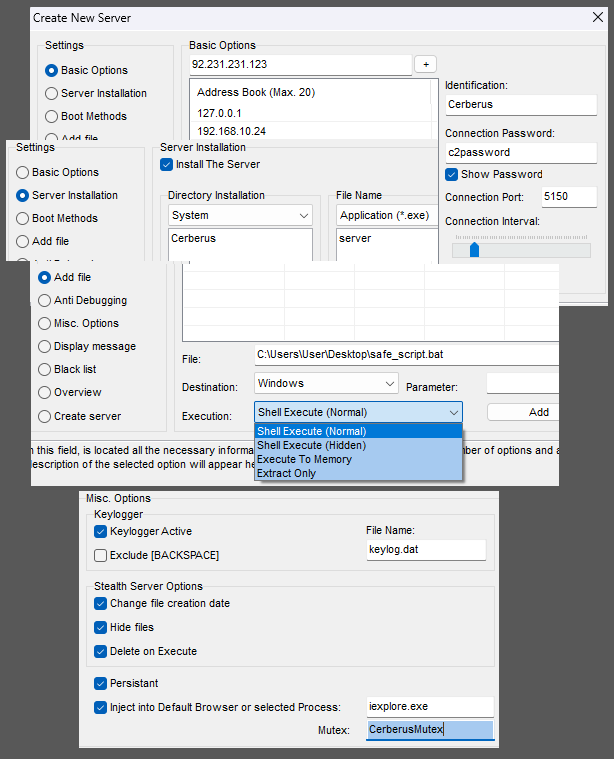

Using [Binary Refinery](https://binref.github.io/) to list resources, I found resources named `CERBERUS` and `A02`. These resources are loaded in using `FindResourceA`, `LoadResource`, `LockResource`, and `SizeofResource` API calls. Then passing the loaded resource through a single XOR decryption routine. Configuration data is then decrypted with the same routine and glued into the loaded resource.

*Decryption and extraction of resources using Binref:*

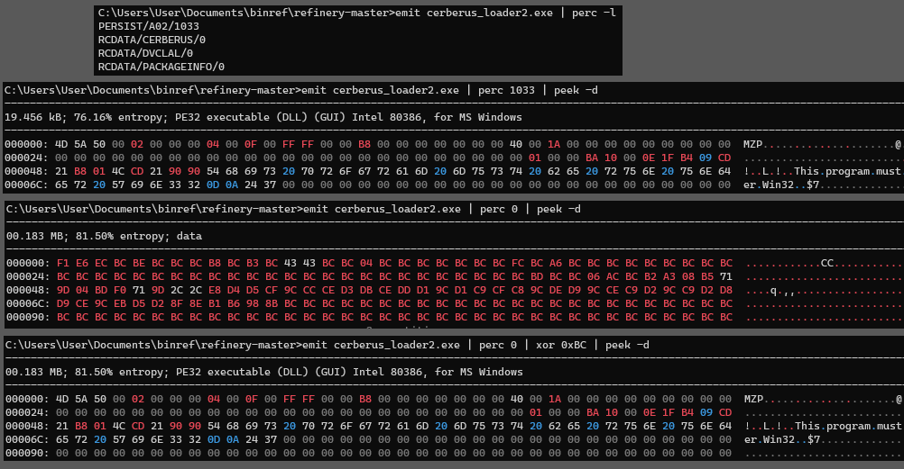

*Decryption routine of the loaded resource:*

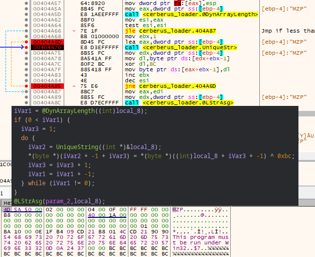

The extracted CERBERUS resource is revealed to be the main module/server component and a quick strings output over this DLL reveals config data, plugin module names, and some settings data in plain text. 

*Module names from strings output:*

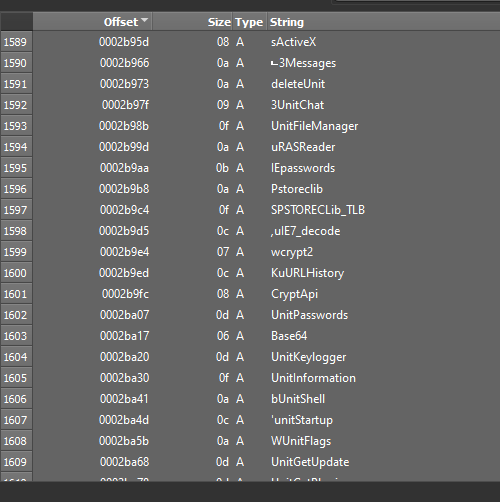

The other resource `PERSIST/A02` is also a complete PE file and appears to be a dummy executable. The purpose of the dummy executable is for when the loader is unable to locate or startup Internet Explorer. If this happens it will open this dummy executable in a suspended state and inject the server into it. 

## The Loader

The loader starts by querying `HKU\Cerberus\Software\StartPersist` and deletes it if it exists (both the loader and persisted server will query values in the registry on start up for host environment data to see if running as a first execution or not). The loader then runs a few anti-sandbox and anti-virtual environment functions. It starts by checking for `VirtualPC` (an old virtualization application for Windows hosts that was discontinued in 2011 in favor of Hyper-V) by setting up and exception handler, then executing illegal instructions that would, in a non-virtual environment, generate exceptions on the real CPU, but would be executed without exception in a VM (see [UD instructions](https://www.felixcloutier.com/x86/ud)). It will check for `VirtualBox` by iterating processes using `CreateToolHelp32Snapshot`, searching for `VBoxService.exe`. It will check for VMWare by using the backdoor communications channel (if running in VMWare a port named `VX` will be available for communication). It will also run a very outdated sandbox checking function, checking for sandboxie/anubis/CWsandbox/Joesandbox/threatexpert, using common Windows versions and DLLs that were used by these sandboxes at the time.

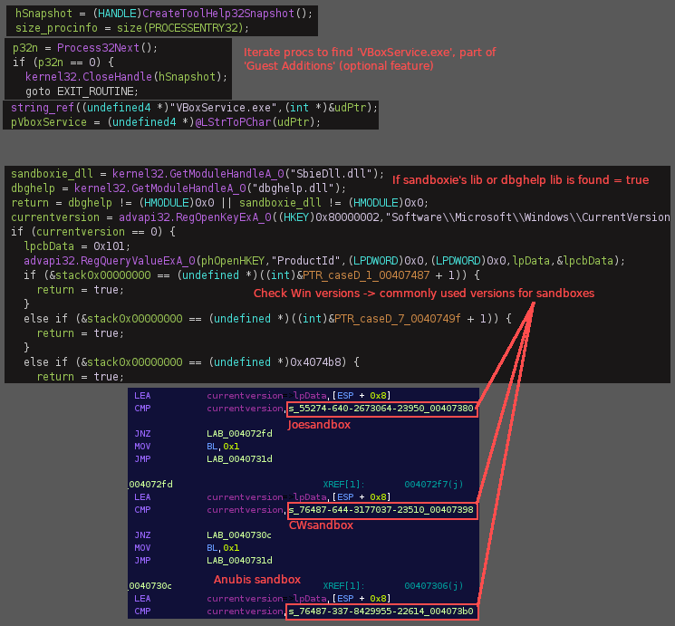
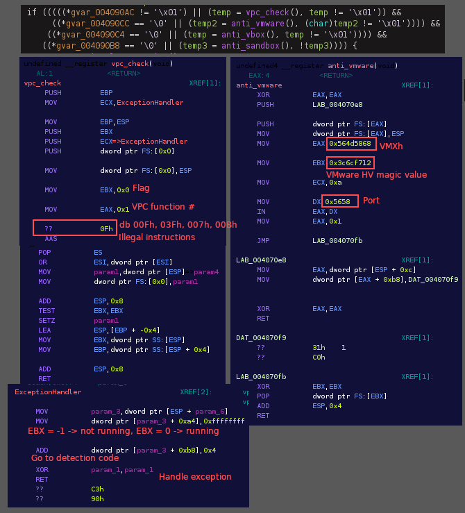

There is an option in the builder application that allows the attacker to enter a list of processes and services to be terminated when the loader is run. It will iterate through both of these lists of processes/services on the system and attempt to shut them down.

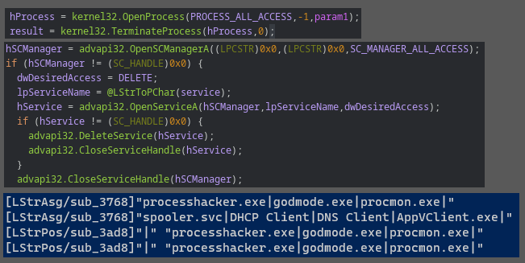

After opening either Internet Explorer or the A02 dummy executable (backup) in a suspended state and loading the CERBERUS server DLL into an arbitrary location in memory, the loader will run it's main injection routine using the [BTMemoryModule](https://github.com/DSPlayer/memorymodule). The technique allows the loading of the DLL from memory without storing it on disk (similar to [reflective DLL injection](https://github.com/stephenfewer/ReflectiveDLLInjection)). `BTMemoryModule` allows the DLL to be loaded as a `TMemoryStream` (stored in a dynamic memory buffer that is enhanced with file-like access capabilities) with `BTMemoryLoadLibrary` and `BTMemoryGetProcAddress`. [This](https://www.joachim-bauch.de/tutorials/loading-a-dll-from-memory/comment-page-1/) is a great tutorial that goes over this process in more detail. 

*Injection routine:*

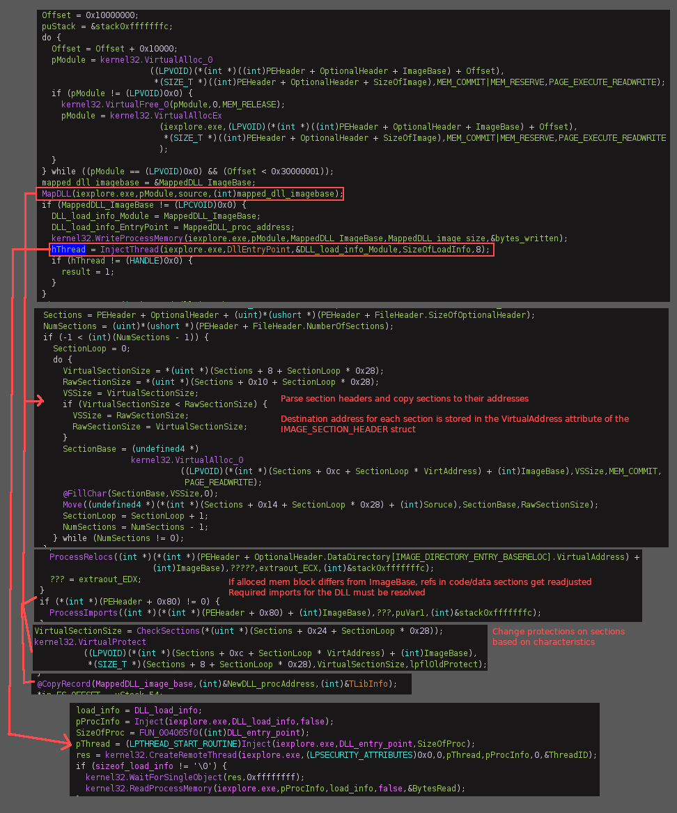

*View of the loaded DLL and components in RWX memory pages:*

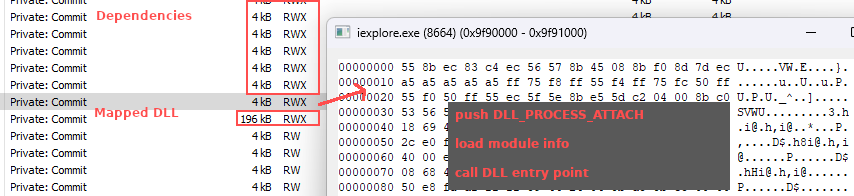

## The Server

The server starts off by loading in a stub file to append settings/config data to. There is then a single XOR decryption routine followed by an encoding routine that run over the configuration/settings data before gluing it to the stub file. 

*Main string encryption routine found throughout the server:*

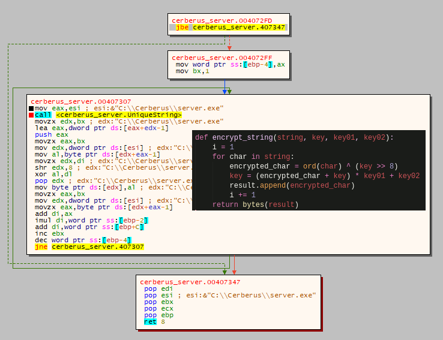

We can extract the config data from the extracted DLL using [frida-trace](https://frida.re/docs/frida-trace/) (and here are some good [blog](https://www.hexacorn.com/blog/2022/01/28/delphi-api-monitoring-with-frida/) [posts](https://www.hexacorn.com/blog/2022/02/20/delphi-api-monitoring-with-frida-part-3/) on using frida-trace with Delphi binaries). This sample will call Delphi string assignment, position, and concatenation functions after the decryption/decoding routines, so we can just create some hooks to intercept the arguments of these functions.

*Example output from @LStrAsg, @LStrPos, and @LStrCmp:*

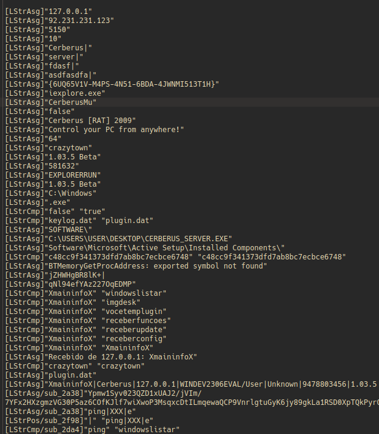

The server will query the `HKU\Cerberus\Software` key for `identification` and `configfile` values, which I can not figure out why, neither of those values are mentioned anywhere else. If it finds that it is running from 'persist' it will create a mutex name that ends with `_PERSIST`. If the server is not running from 'persist' and was a first run execution, it will copy the loader to a new location in the file system, rename it, and delete the original. The new 'persist' location is custom selected in the builder, ex: C:\Windows\Update\iexploreupdate.exe (hidden with `SetFileAttributesA()` + `sw_hide`). Information on persistence, setup, environment, paths etc., are encrypted with the same simple XOR cipher and encoding routine as mentioned before. Using `RegSetValueExA` the data is put in the `HKU\Cerberus\Software` location (as observed in the previous post). Looping through this encryption/encoding routine in the debugger reveals that environment, path, and configuration data are stored in this registry location.

**HKLM\SOFTWARE\WOW6432Node\Microsoft\ActiveSetup\InstalledComponents\***
 * {6UQ65V1V-M4PS-4N51-6BDA-4JWNMI513T1H}\StubPath:"C:\Windows\DefinietlyInternetExplorer\IExplorerUpdate.exe Restart" (boot/logon persistence)

**HKU\SID\Software\Cerberus\***
 * FirstExecution:"10/16/2023" 
 * FileName:"Dlzcs1bl2+45iWIfMnZbSdbHXj9Bn(..SNIP..)" `path and information related to the loader`
 * HKLM:"JZGTLMqroNCIPiDadaltMA" (ASEP/runkey)
 * HKCU:"JZGTLMqroNCIPiDadaltPA" (ASEP/runkey)
 * StartPersist:"Dlzcs1bl2+45iWIfMnZbSdbHXj(..SNIP..)" `configuration data related to the server`

Connection to the C&C is done using winsock functions and uses the previously mentioned XOR encryption/encoding and decryption/decoding routine for sending and receving data. Once connected, a mutex is setup with a name that ends in `_SAIR`. Pings are sent/recived every few seconds. 

The builder gives the option of compiling the server/implant with all of the features at once, or making a lighter executable and downloading plugins once connected. If the plugin is not compiled with the loader then there is option to automatically send it over on first sucessful connection, or to send it via `URLDownloadToFileA`. The plugins all come in a single DLL that contains the other half of the server's functions and is stored as a .dat file on disk (hidden with with `SetFileAttributesA()` + `sw_hide`) in the same directory as the copied loader and keylog data file (if enabled). Functions from the module are loaded in memory using the `BTMemoryModuleLoad` and resloved with `BTMemoryGetProcAddress`.

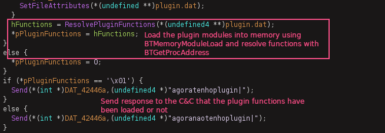

*Options from the C2 panel once connection is established:*

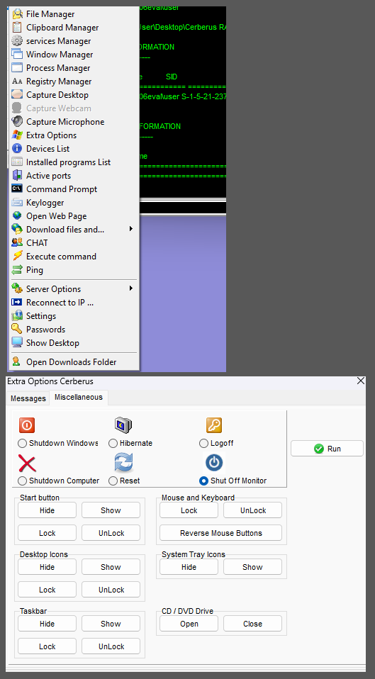

## Resources 

[https://www.reversinglabs.com/blog/spying-on-spynet](https://www.reversinglabs.com/blog/spying-on-spynet)

[https://www.joachim-bauch.de/tutorials/loading-a-dll-from-memory/comment-page-1/](https://www.joachim-bauch.de/tutorials/loading-a-dll-from-memory/comment-page-1/)

[https://www.felixcloutier.com/x86/ud](https://www.felixcloutier.com/x86/ud)

[https://github.com/malwares/Remote-Access-Trojan/tree/master/Spy-net.2.7.beta](https://github.com/malwares/Remote-Access-Trojan/tree/master/Spy-net.2.7.beta)

[https://www.hexacorn.com/blog/2022/01/28/delphi-api-monitoring-with-frida/](https://www.hexacorn.com/blog/2022/01/28/delphi-api-monitoring-with-frida/) 

[https://hshrzd.wordpress.com/2016/07/21/how-to-turn-a-dll-into-a-standalone-exe/](https://hshrzd.wordpress.com/2016/07/21/how-to-turn-a-dll-into-a-standalone-exe/)

[https://www.hexacorn.com/blog/2022/01/28/delphi-api-monitoring-with-frida/](https://www.hexacorn.com/blog/2022/01/28/delphi-api-monitoring-with-frida/)

[https://frida.re/docs/frida-trace/](https://frida.re/docs/frida-trace/)

[https://blag.nullteilerfrei.de/2019/12/23/reverse-engineering-delphi-binaries-in-ghidra-with-dhrake/](https://blag.nullteilerfrei.de/2019/12/23/reverse-engineering-delphi-binaries-in-ghidra-with-dhrake/)

[https://binref.github.io/](https://binref.github.io/)

[https://github.com/crypto2011/IDR](https://github.com/crypto2011/IDR) 

[https://github.com/huettenhain/dhrake](https://github.com/huettenhain/dhrake)

