---
layout: post
title: "Analyzing a Sample of Redosdru"
categories: malware
--- 

This writeup takes a look at a recently uploaded sample of Redosdru, a RAT that's been around for a while. I'll cover config extraction and a quick look at some of it's features. 

## Initial Analysis

Sample: 79c061e457eae6fe5e1ed54eb37e968e8d49d130b8723e2bd8fa8ce4329f81db

When the sample is executed it will create a copy of itself as `Ulpktkx.exe` inside a newly created directory in Program Files (x86) named `Microsoft Zquztu`, self-delete, then create a directory in Program Files named `AppPatch` and write an empty file named `NetSyst96.dll` inside. It will then reach out to `http://164.155.231.101:16/NetSyst96.dll` and read/write 400 bytes of data at a time to the recently created `NetSyst96.dll` file on disk. The newly created DLL on disk is RC4 encrypted and missing headers.

*HFS server at http://164.155.231.101:16/NetSyst96.dll*
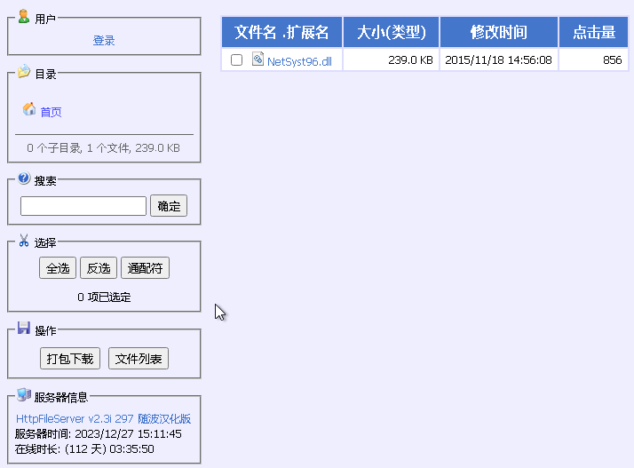

The frist stage process then loads in the `NetSyst96` DLL, RC4 decrypts, attaches headers, and calls the `DllFuUpgradrs` export. 

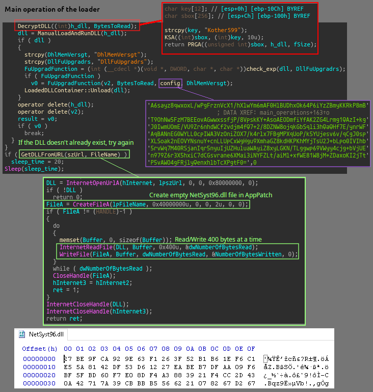

The DLL can be extracted easily in a dubugger by placing breakpoints after the decryption routine. The binary shows up as KuGou.dll in metadata as it's original file name, with 'company name' as kugou.com Inc., which is a Chinese music streaming and download service.

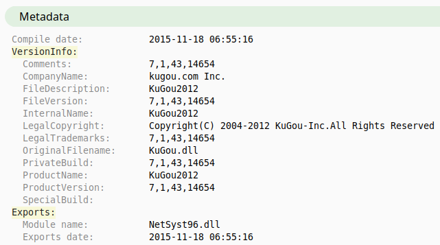

## Config Extraction

The two main parts of the inital config are held in the .data section on the first stage binary and are base64 encoded and RC4 encrypted. There is a routine in the first stage binary for the download URL 
(the smaller blob of config data) with the other blob of data getting used within the main module (KuGou/NetSyst96 DLL). The routine is basic RC4 with an added for loop that iterates over the range of the decoded string, and uses an additional addition and XOR operation on the byte value at the current index.

Implementing a way to automatically extract and decrypt this data in Python can be done by loacting the blobs in the data section with regex and reimplementing the routine. Full script is on my [github](https://github.com/rb3nzr/Malware-Script-Dump/blob/main/Redosdru/redosdru_config_ex.py).

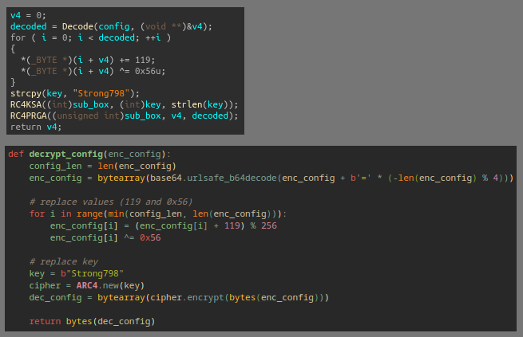

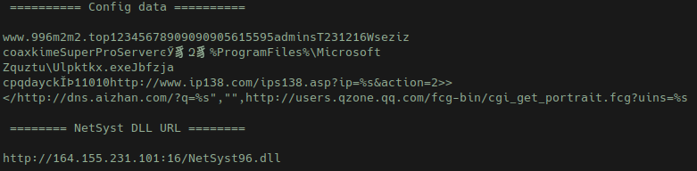

## NetSyst96.dll/KuGou.dll 

Inside the `DllFuUpgradrs` function, the config data gets decrypted, and values get parsed then set to globals in the data section. `CreateEventA` is called with an lpName value of `Jbfzja Cpqdayck`, with the return value getting checked as a way to see if redosdru is already running on the machine. If GetLastError returns ERROR_ALREADY_EXISTS, then a self-delete VB script is written to disk and run with `ShellExecuteA`.

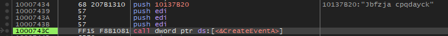

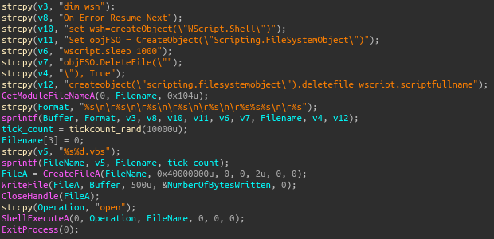

Standard run keys are created with the name `wseziz coaxkime`, pointing to the `Ulpktkx.exe` binary on disk. This binary is registered as a service, and creates a key in `SYSTEM\CurrentControlSet\Services\` with `ConnectGroup` and `MarkTime` (date when the file is executed) subkeys. The service is created with SERVICE_ALL_ACCESS (allows the changing of the service config), SERVICE_AUTO_START (automatic startup at boot), SERVICE_INTERACTIVE_PROCESS (lets the process interact with the desktop), SERVICE_WIN32_OWN_PROCESS (service that runs in it's own process), then `ChangeServiceConfig2A` is called with the description for the service as `SuperProServer`.

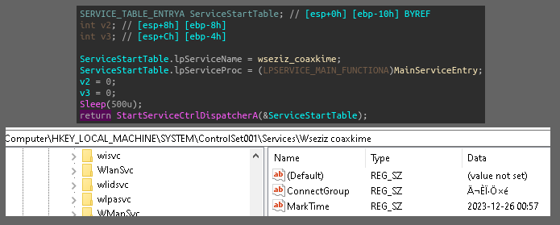

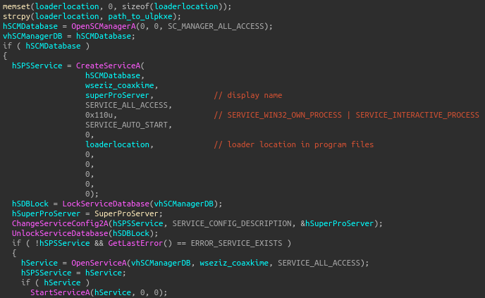

Before setting up for it's communication routine, redosdru will start a new thread to concurrently execute a function that waits to download a binary from `http://baihes.com:8282`, either `xm.exe` or `cpa.exe`, based on system version and a time condition. It will start a loop with a 30 minute sleep that checks to see if the integer value of local time/date set in the function is greater than the local time/date that had been set in the `MarkTime` subkey, and that the current time/date int value minus the MarkTime is greater than or equal to 5. If this condition is met then a function is called that downloads the binary, writes to a file, and starts the binary with `CreateProcessA` under the default desktop. 

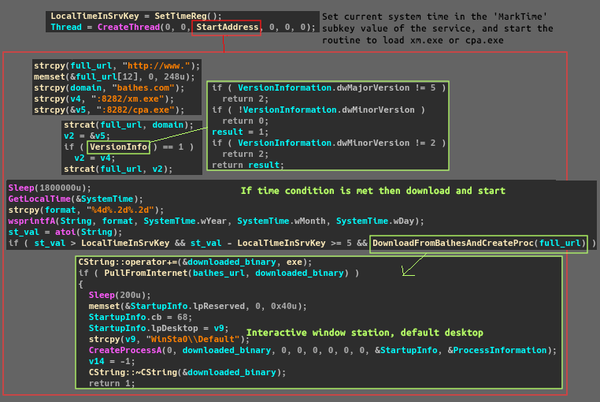

System information is collected, packets then get assemebled and the data gets sent and received with a similar RC4 encryption routine with the key of `5615595admins`, using zlib 1.1.4. deflate, wininet API functions, and connecting out to `996m2m2.top` on port `9090`(websm). 

## Features

Features seem pretty bloated, there is a large amount of command modules all contained in the main DLL, most just appear to be standard ones found in most RATs.

There are a few functions revolving around setting up RDP: `KeepRasConnection` is set to `HKLM\Software\Microsoft\Windows NT\CurrentVersion\Winlogon` as a way to keep RDP connections alive after logoff of a user. `EnableConcurrentSessions` being set in the licensing core registry key and `fDenyTSConnections` being set in the terminal services registry key ensures remote desktop access is active and allows multiple sessions with an option to change the ports. 

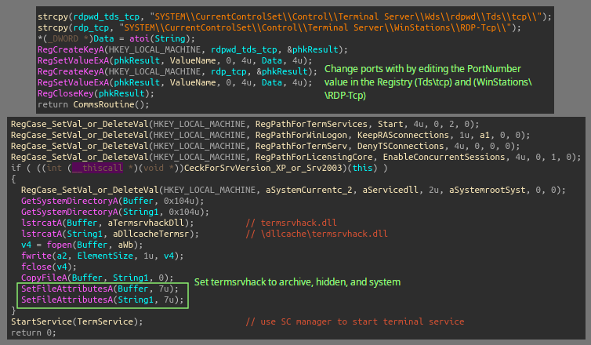

A module will utilizes COM in order to access devices and services: enumeration of system devices, including attempting to access webcam devices for recording, using `SystemDeviceEnumerator`, DirectShow objects like `CaptureGraphBuilder` with the `ICaptureGraphBuilder2` interface, in order to build and control capture graphs (filter graph that performs video or audio capture). It interacts with IExplorer using the `Microsoft Url History Service` and the `IUrlHistoryStg2` interface in order to search through and interact with browser history. 

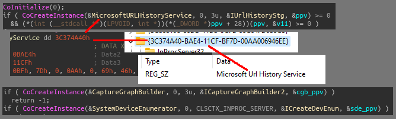

There is a master boot record stomping function: the stomping/overwritting is done by locking `PHYSICALDRIVE0` (the entire disk that the OS sits on) with `FSCTL_LOCK_VOLUME` as the control code passed to the `DeviceIoControl` call, then writing a buffer the size of the MBR (first 512 byte sector) that contains an error message and bytes `0x55` and `0xAA` at the end. These last two bytes are the boot sector signature, which is a marker used to indicate that the disk is bootable.

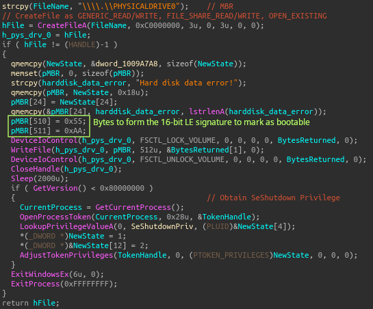

There is a command option that can open IExplorer: this is done by grabbing the value in the registry assocaited with launching the browser, replacing the placeholder %1 with the given remote command then calls `CreateProcessA` to start the browser. Most likely used to leverage the browser for downloads. 

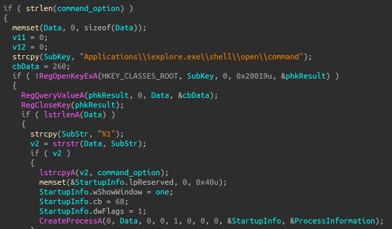

Commands that deal with enumerating running processes: these are used to either shut processes down or gather and send related information to the C&C. Of course this is done with `CreateToolHelp32Snapshot` and `Process32Next`! Almost all of the calls to process enumeration functions are related to searching for AV/EDR/Monitoring software. Example one below is for ArpGuard, a LAN monitoring software, and example two is a very long list of general AV/EDR stuff.

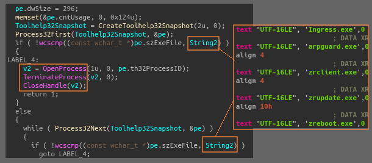

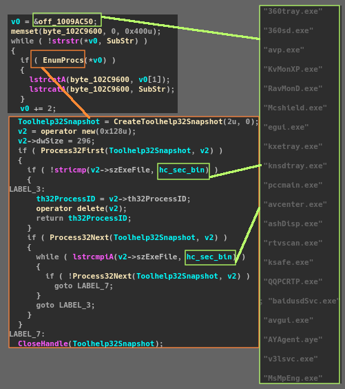

Clearing Security, Application, and System event logs (no Sysmon??):

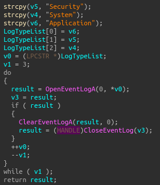

Keylogging:

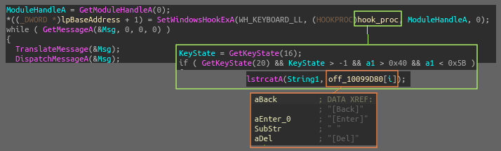

## Further Infection 

The process eventually downloaded and started a binary named `windowss.exe`, a very beefy 5.3 MiB executable, which appears to be the malware known as `Lucifer` ([info](https://unit42.paloaltonetworks.com/lucifer-new-cryptojacking-and-ddos-hybrid-malware/)). The process also downloaded a handful of the Equation Group’s `FuzzBunch` tools (some info if not familiar: [1](https://en.wikipedia.org/wiki/Equation_Group#2016_breach_of_the_Equation_Group) [2](https://github.com/x0rz/EQGRP_Lost_in_Translation/tree/master/windows) [3](https://www.rapid7.com/blog/post/2017/04/18/the-shadow-brokers-leaked-exploits-faq/) [4](https://zerosum0x0.blogspot.com/2017/04/doublepulsar-initial-smb-backdoor-ring.html)). An `XMRig` crypto miner with arguments `spreadMnopqr.exe -o stratum+tcp://pool.supportxmr.com:3333 -u 483DY[snip]Ht34G -p H –max-cpu-usage=25 -K` was also dropped and started.

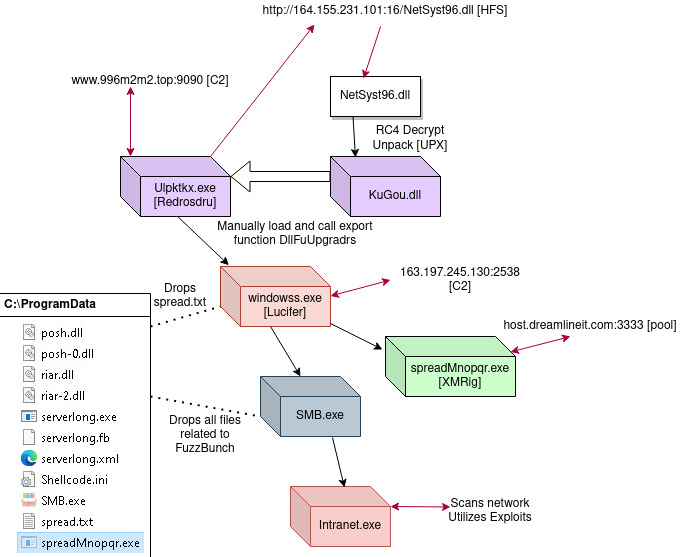

XMRig for mining Monero (with 'algo' rx/0), using the Stratum proxy protocol, and the pool supportxmr.com:

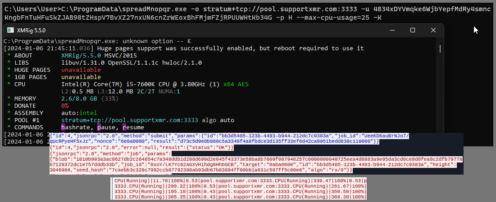

## Sample Correlation

It was hard finding any good information on this RAT, but it appears to have been around for a while and goes by other names on Chinese speaking blogs. Curious to see what has changed from this current sample to some older ones that I was able to download from 2002-2023, I used Diaphora to diff a few of the first stage and main modules binaries. I found only minimal changes amongst functions in the main KuGou.dll modules; the overall structure and functionality appear to be the same, and no major functions seem to be added or removed. The older redosdru samples are mostly similar to the current, yet had more anti-debugging tricks such as nested SEH try/catch stuff in them, as well as the main KuGou/NetSyst DLL packed inside. So maybe this downloading a headerless encrypted DLL from an HFS server is a new feature with redosdru.

## IOCs

1. 163.197.245.130:9090 (www.996m2m2.top) → Redosdru connects [C&C]
2. 163.197.245.130:2538 (www.996m2m2.top) → Lucifer connects  [C&C]
3. http://164.155.231.101:16/NetSyst96.dll → HFS for NetSyst96.dll
4. 104.243.33.118 (host.dreamlineit.com:3333) → Mining pool
5. http://users.qzone.qq.com/fcg-bin/cgi_get_portrait.fcg?uins=12345678 
    callback -> http://qlogo3.store.qq.com/qzone/12345678/12345678/100

