This writeup takes a look at a recently uploaded sample of Redosdru. I will go over the main remote access module and loading process, as well as a quick look at the processes that end up running on the infected system, including Lucifer, a crypto miner and DDoS hybrid that drops and leverages Equation Group’s FuzzBunch tools for spreading and further control.

## Initial Analysis

Sample: 79c061e457eae6fe5e1ed54eb37e968e8d49d130b8723e2bd8fa8ce4329f81db

When the Redosdru loader is executed it will create a copy of itself as `Ulpktkx.exe` inside a newly created directory in Program Files (x86) named `Microsoft Zquztu`. It then creates a directory in Program Files named `AppPatch` and writes an empty file named `NetSyst96.dll` inside. It will then reach out to `http://164.155.231.101:16/NetSyst96.dll` and read/write 400 bytes of data at a time to the recently created NetSyst96.dll file on disk. At this point the DLL is encrypted, UPX packed, and missing DOS and NT headers. The original loader gets deleted and both the copied loader and main module stay on disk and never get removed. In memory the DLL gets headers attached and RC4 decrypted. Then, taking raw bytes of the DLL it will write sections, apply relocations, load imports, return the loaded DLL container object, get the address of the export, call the entrypoint to signal unload, free loaded imports, VirtualFree the memory, and HeapFree the container object. The export function `DllFuUpgradrs` with the config data passed into it gets called and the loader’s job is done.

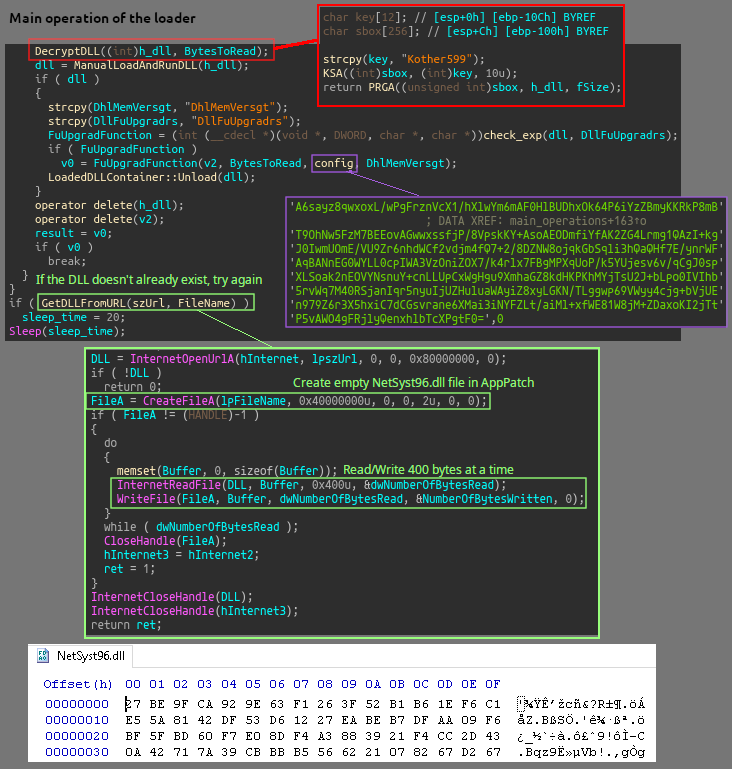

After extracting the decrypted NetSyst DLL from memory by placing breakpoints at the end of the RC4 routine, then unpacking with UPX, the DLL shows up as KuGou.dll, refering to kugou.com, a Chinese music streaming site.

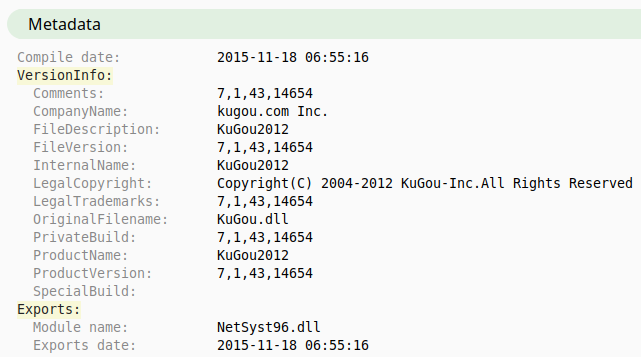

Packet capture shows the DLL is downloaded from an HTTP file server:

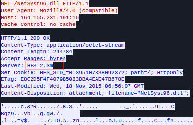

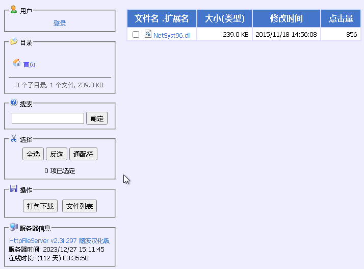

## Config Extraction

The two main parts of the inital config data are held in the data section on the loader in base64 encoded and RC4 encrypted blobs. There is a routine in the loader for the URL and the other routines lie in the DLL. It's just standard base64 and RC4 with an added for loop that iterates over the range of the decoded string, and uses an addition and XOR operation on the byte value at the current index.

Implementing a way to automatically extract a decode/decrypt this data in Python can be done by loacting the blobs in the data section with regex and reimplementing the routine. Full script is on my [github](https://github.com/rb3nzr/Malware-Script-Dump/blob/main/Redosdru/redosdru_config_ex.py).

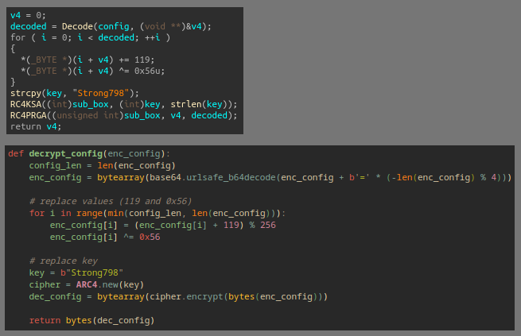

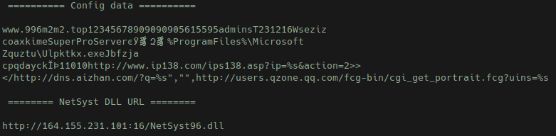

## NetSyst96.dll/KuGou.dll 

Once the export function DllFuUpgradrs is called the config data gets decrypted, and values get parsed then set to globals in the data section. The function will then make a series of checks, most notably a check for an event named `Jbfzja Cpqdayck`. If this event is already running on the machine then the function will concatenate a self delte VB script, write it, then call `ShellExecute` and exit.

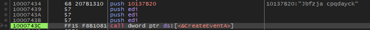

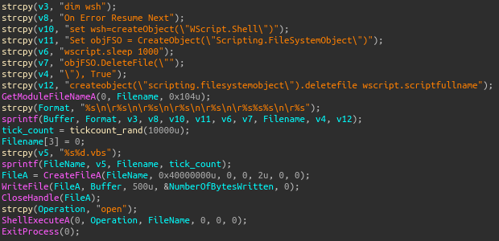

After gaining SeDebugPriveledge the function will attempt a few persistence techniques. It will create an HKLM and HKCU run key named `wseziz coaxkime` pointing to the loader on disk, register a service to ensure it's automatic execution at every system startup, and create a key in `SYSTEM\CurrentControlSet\Services\` with `ConnectGroup` and `MarkTime` subkeys. The service is created with SERVICE_ALL_ACCESS (allows the chaning of the service config), SERVICE_AUTO_START (automatic startup at boot), SERVICE_INTERACTIVE_PROCESS (lets the process interact with the desktop), SERVICE_WIN32_OWN_PROCESS, and itself as the binary path. It then calls `ChangeServiceConfig2A`, passing SERVICE_CONFIG_DESCRIPTION with the description field set to the name `SuperProServer`, and starts the service.

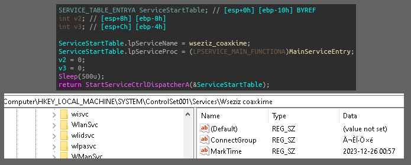

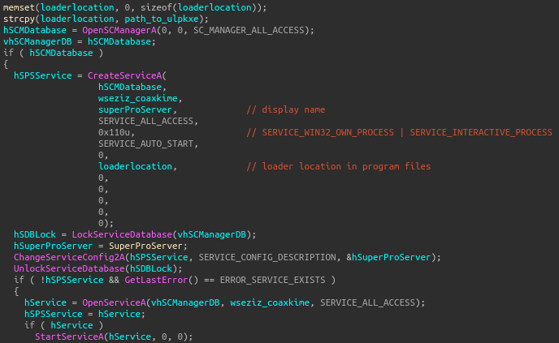

# Inside the Service Entry Function

Before setting up for it's communication routines Redosdru will start a new thread to concurrently carry out a function that waits to download a binary from http://baihes.com:8282, either xm.exe or cpa.exe, based on system version and a time condition. It will start a loop with a 30 minute sleep that will check to see if the integer value of local time/date set in the function is greater than the local time/date that had been set in the `MarkTime` subkey, and that the current time/date int value minus the MarkTime is greater than or equal to 5. If this condition is met then a function is called that downloads the binary, writes to a file, then starts the binary with `CreateProcessA` under the default desktop. 

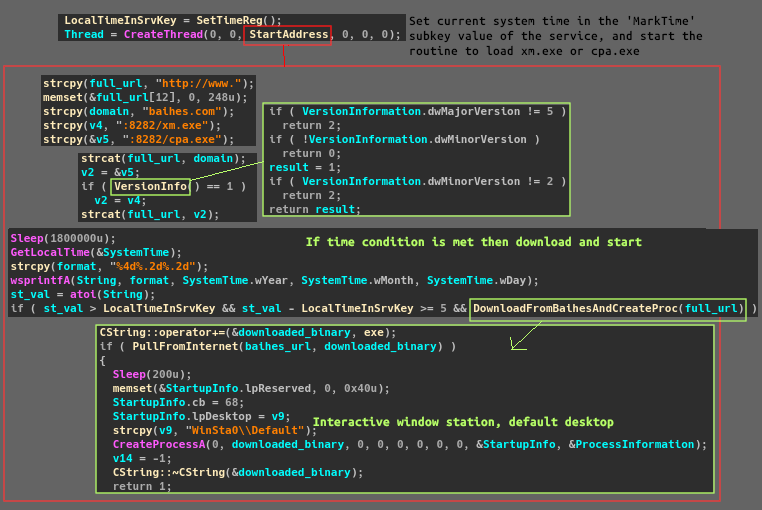

Most of the other functions before communicating out will check and store system information. Packets then get assemebled and the data gets sent and received with a similar RC4 encryption routine with the key of `5615595admins`, using zlib 1.1.4. deflate, using wininet API functions,  and connecting out to `996m2m2.top` on port `9090`(websm). 

# Command Functionality

Most of the command modules in the DLL revolve around retrieving data about the target system, most likely in order to locate and identify the infected machine, and determine the possible value of the machine so that other modules/payloads can be pushed. 

**There are a few functions revolving around setting up RDP:** `KeepRasConnection` is set to `HKLM\Software\Microsoft\Windows NT\CurrentVersion\Winlogon` as a way to keep RDP connections alive after logoff of a user. `EnableConcurrentSessions` being set in the licensing core registry key and `fDenyTSConnections` being set in the terminal services registry key ensures remote desktop access is active and allows multiple sessions with an option to change the ports. 

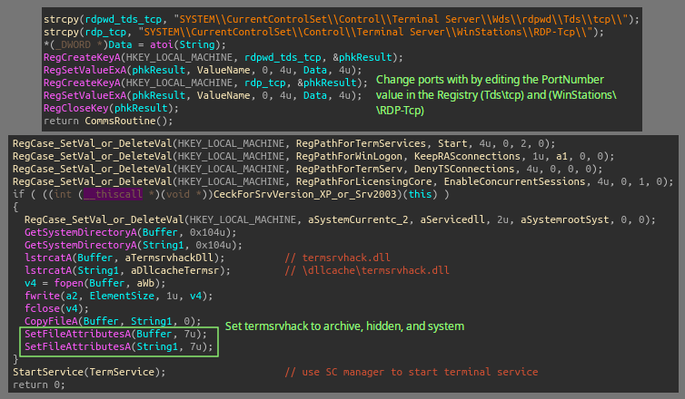

**The module will utilize COM objects in order to access devices and services:** enumeration of system devices, including attempting to access webcam devices for recording, using `SystemDeviceEnumerator`, DirectShow objects like `CaptureGraphBuilder` with the `ICaptureGraphBuilder2` interface, in order to build and control capture graphs (filter graph that performs video or audio capture). It interacts with IExplorer using the `Microsoft Url History Service` and the `IUrlHistoryStg2` interface in order to search through and interact with browser history. 

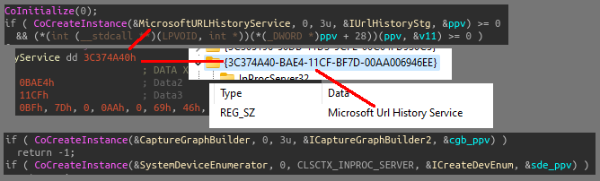

**There is a master boot record stomping function:** the stomping/overwritting is done by locking `PHYSICALDRIVE0` (the entire disk that the OS sits on) with `FSCTL_LOCK_VOLUME` as the control code passed to the `DeviceIoControl` call, then writing a buffer the size of the MBR (first 512 byte sector) that contains an error message and bytes `0x55` and `0xAA` at the end. These last two bytes are the boot sector signature, which is a marker used to indicate that the disk is bootable.

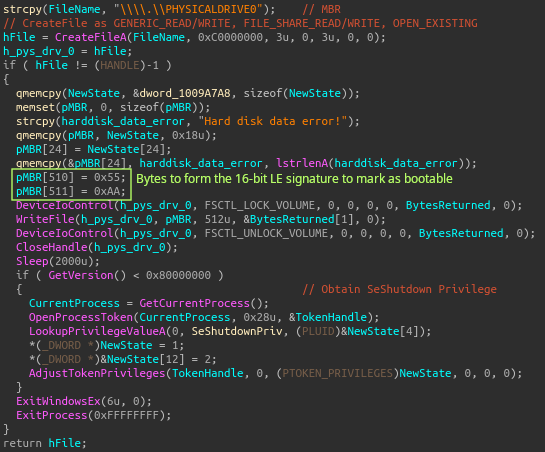

**There is a command option that can open Iexplorer:** this is done by grabbing the value in the registry assocaited with launching the browser, replacing the placeholder %1 with the given remote command then calls CreateProcesA to start the browser. Most likely used to leverage the browser for downloads. 

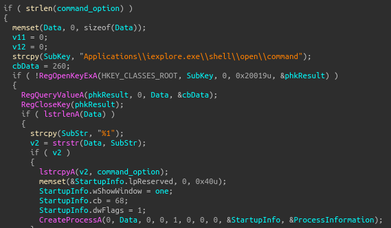

**Commands that deal with enumerating running processes:** these are used to either shut processes down or gather and send related information to the C&C. Of course this is done with `CreateToolHelp32Snapshot` and `Process32Next`! Almost all of the calls to process enumeration functions are related to searching for AV/EDR/Monitoring software. Example one below is for ArpGuard, a LAN monitoring software, and example two is a very long list of general AV/EDR stuff.

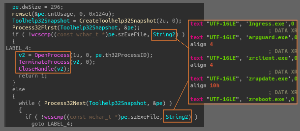

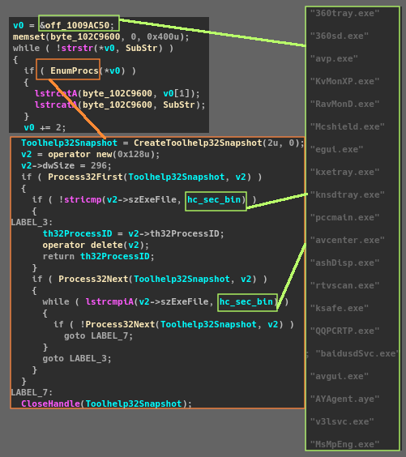

**Clearing Security, Application, and System event logs (no Sysmon?):**

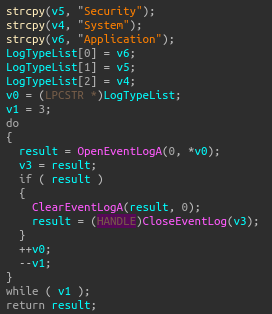

**Keylogging:**

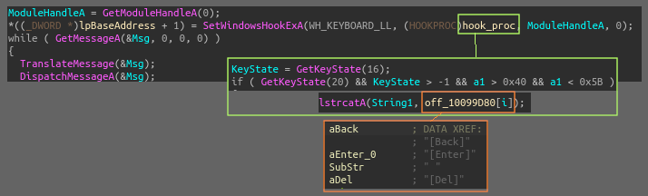

## Further Down the Infection Chain

The infection eventually spawned a process named `windowss.exe`, a very beefy 5.3 MiB executable, which appears to be the malware known as `Lucifer`. The process will drop a handful of the Equation Group’s FuzzBunch tools, do some checking on system bandwidth, drop and launch the XMRig miner with arguments `spreadMnopqr.exe -o stratum+tcp://pool.supportxmr.com:3333 -u 483DY[snip]Ht34G -p H –max-cpu-usage=25 -K`, copy itself as `spread.txt`, then launch `SMB.exe` which drops all of the associated FuzzBunch tools and starts `Intranet.exe`, which utilizes them. All of these files are dropped in `C:\ProgramData`. 

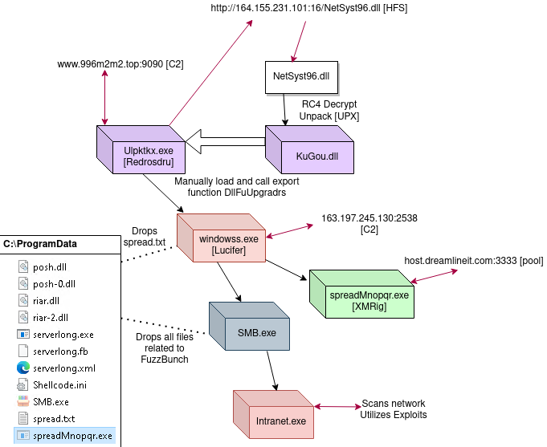

XMRig for mining Monero (with 'algo' rx/0), using the Stratum proxy protocol, and the pool supportxmr.com:

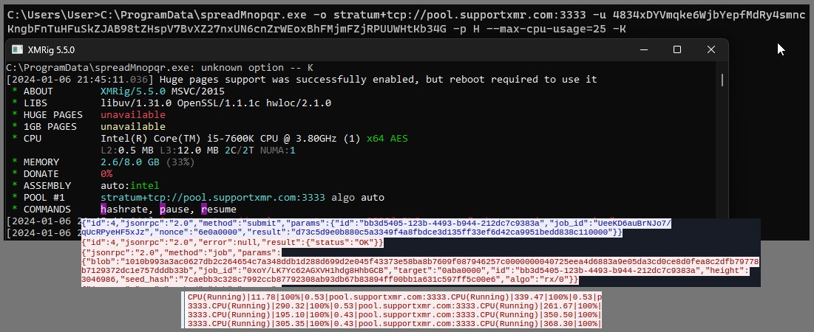

## Sample Correlation

Using Diaphora to do some quick diffing between previously uploaded loaders and main DLL modules with samples from 2022 to 2023: I found only minimal changes amongst functions in the main KuGou.dll modules; the overall structure and functionality appear to be the same, and no major functions seem to be added or removed. In contrast, the comparisons in Redosdru loader variants appear to be completely different in their control flow, including using more anti-debugging tricks such as nested SEH (try{} catch{}) trickery and some of the classic Windows API functions. These variants also contained the KuGou/NetSyst DLL module, packed as a resource inside the binary. It appears that the loader is getting redeveloped and updated, whereas the main module is not.

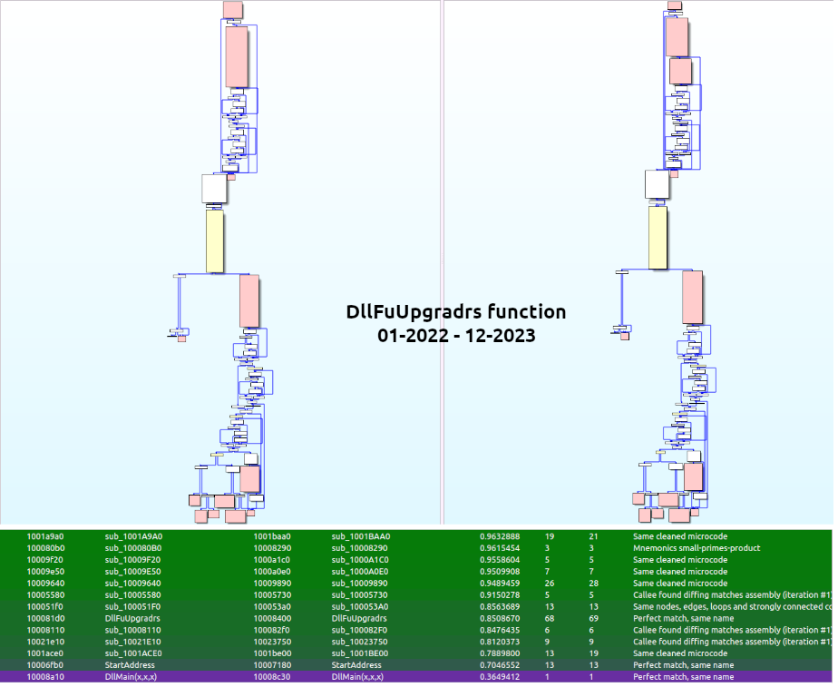

## IOCs

1. 163.197.245.130:9090 (www.996m2m2.top) → Redosdru connects [C&C]
2. 163.197.245.130:2538 (www.996m2m2.top) → Lucifer connects  [C&C]
3. http://164.155.231.101:16/NetSyst96.dll → HFS for NetSyst96.dll
4. 104.243.33.118 (host.dreamlineit.com:3333) → Mining pool
5. http://users.qzone.qq.com/fcg-bin/cgi_get_portrait.fcg?uins=12345678 
    callback -> http://qlogo3.store.qq.com/qzone/12345678/12345678/100

## References

[https://en.wikipedia.org/wiki/Equation_Group#2016_breach_of_the_Equation_Group](https://en.wikipedia.org/wiki/Equation_Group#2016_breach_of_the_Equation_Group)

[https://github.com/x0rz/EQGRP_Lost_in_Translation/tree/master/windows](https://github.com/x0rz/EQGRP_Lost_in_Translation/tree/master/windows)

[https://www.rapid7.com/blog/post/2017/04/18/the-shadow-brokers-leaked-exploits-faq/](https://www.rapid7.com/blog/post/2017/04/18/the-shadow-brokers-leaked-exploits-faq/)

[https://zerosum0x0.blogspot.com/2017/04/doublepulsar-initial-smb-backdoor-ring.htm](https://zerosum0x0.blogspot.com/2017/04/doublepulsar-initial-smb-backdoor-ring.html)

[https://unit42.paloaltonetworks.com/lucifer-new-cryptojacking-and-ddos-hybrid-malware/](https://unit42.paloaltonetworks.com/lucifer-new-cryptojacking-and-ddos-hybrid-malware/)

[https://github.com/joxeankoret/diaphora](https://github.com/joxeankoret/diaphora)
