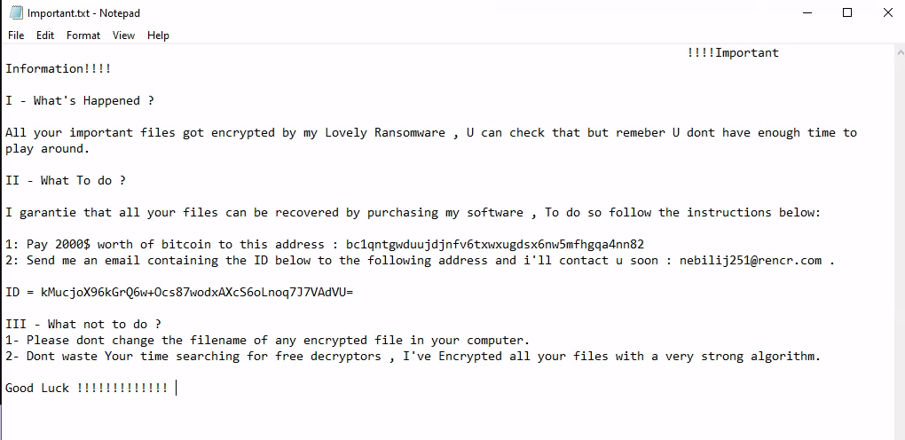

Lovely Malware is an insane difficulty malware RE [sherlock](https://app.hackthebox.com/sherlocks/Lovely%20Malware), which includes a PE file, pcap file, and an encrypted .txt.naso file. I'll start with covering what I did to decrypt config data and resolve windows API hashes, as these were an easy first place to start, and curcial to figuring out where to look. I'll then go into how the key is generated, how files are encrypted, and how the key is transformed before being sent back to the TA with the victim host information. From the knowledge gained, if provided with a capure file that contains the network traffic from the sample, one would be able to decrypt their files.

**Scenario Description:** *An employee at NeirCyber Security discovered a suspicious file named employee_benefits.exe on their desktop. The employee found the file after returning from lunch and immediately reported it to the IT security team, suspecting that it could be malicious. The objective is to reverse engineer the file and dissect its inner workings.*

[https://labs.hackthebox.com/achievement/sherlock/1229827/762](https://labs.hackthebox.com/achievement/sherlock/1229827/762)

## Initial Analysis
**update.exe SHA256 (Task 1):** 83cb5e8b7455fcb3b6c2d45269b08b3ae003dfed4ce8ca942cd007c1ebf17cf2

I started off by looking around in some online sandbox reports, then launching the sample in a VM with procmon, regshot etc. When executing the binary from the terminal, my VM shut down, and when double clicking the exe (launching under explorer.exe) it ran without issue (indication that it is probably checking for `explorer` as a parent process). Files in the VM got encrypted with the `.naso` extension, and a ransom note poped up in notepad that contained the address for sending the TA bitcoin (only 2k, what a deal).



From simple dynamic analysis and sandboxes we can see the mutex name that's used, as well as the commands utilizing `vssadmin` and `bcdedit` (this used to be common with ransomware for deleting/disabling OS recovery features). Heres an Elastic [rule](https://github.com/elastic/protections-artifacts/blob/main/behavior/rules/windows/impact_inhibit_system_recovery_via_obfuscated_commands.toml) for detection of utilies used to tamper with system recovery settings like whats used in this sample. Some ways of avoiding command line detections that ransomware groups are using currently include using COM providers, reimplement the actual IOCTL's used by the providers/utilites, or rebooting into safe mode.


**Task 2:** Global\On3_S1d3d_hard
**Task 7:** exe 
**Task 9:** cmd.exe /c vssadmin.exe Delete Shadows /All /Quiet & bcdedit /set {default} recoveryenabled No & bcdedit /set {default} bootstatuspolicy ignoreallfailures
**Task 12:** .naso
**Task 13:** bc1qntgwduujdjnfv6txwxugdsx6nw5mfhgqa4nn82

Next I took a look through the `cap.pcapng` file and the only packet of any value that I found was `14696`, which contains appears to be a unique victim ID, host information, and the key used for encryption of the victim's files, getting sent out to the TA.


**Task 11:** 192.168.1.104:8000

## Decrypting Config Strings
This sample is pretty easy to analyse statically once you mark up the Win API hashes and the config information. Luckly the hash resolving function and the config can be found very early on in the process. You can easily spot a string getting dynamically constructed in a user TLS callback, with the string coming out to equal `Love_Her`. Each character of the string is found in a loop while being put together, and after that a series of moves are made on elements in the .data section to another area of .data. 


Cross referencing the location of where these unknown data elements get passed reveals a large amount of calls to what turns out to be a simple `XOR` encryption function, which contains the `Love_Her` string as the key. Reimplementing this function in python and running these elements through reveals config data. I made a script for Binary Ninja to resolve all of these at once, by iterating the instructions in the callback, finding where the strings were getting moved from, reading them in, decrypting and setting comments.

```python
from binaryninja import *

def love_her_sd(idata: bytes) -> bytes:
	key = b"Love_Her"
	odata = bytearray(idata)
	for i in range(len(idata)):
		odata[i] = (odata[i] - i) & 0xFF
		odata[i] ^= key[i % 8]
	return bytes(odata)

tls_callback = bv.get_function_at(0x7ff636eb24a0) # Edit me
instructions = list(tls_callback.instructions)

resolved_strs = []
for i, (instr_parts, addr) in enumerate(instructions):
	instr_text = ''.join(token.text for token in instr_parts).strip()
	if "lea" in instr_text and "rdx" in instr_text:
		enc_str_addr = instr_text.split("[rel")[-1].split("]")[0].split()
		enc_str_addr = enc_str_addr[0]
		enc_str_addr = int(enc_str_addr, 16)

		size = 0
		max_read = 1024
		for offset in range(max_read):
			b = bv.read(enc_str_addr + offset, 1)
			if not b or b == b'\x00':
				break
			size += 1

		enc_str = bv.read(enc_str_addr, size)
		dec_str = love_her_sd(enc_str)
		resolved_strs.append((hex(addr), dec_str))
		tls_callback.set_comment_at(addr, f"Decrypted to: {dec_str}")

print(">>> Resolved strings <<<")
for addr, dec_str in resolved_strs:
	print(f"{addr}: {dec_str}")
```


From the output we now see vssadmin/bcdedit command strings, the format for the viticim information packet, the mutex, an IP, etc. The ransome note strings get decryped in the final routine by a different function, and there are a few other strings that are not setup here that also get decrypted with the same routine when needed. All strings are decrypted right before being used. 

**Task 3:** Love_Her
**Task 10:** {'Name' : %s , 'Computer' : %s , 'Proc' : %s , 'Key' : %s , 'Id' : %s}

## Resolving Hashes
Now starting to look at the main routine, checking inside the first call we can see our string decryption function resolve the mutex name, then pass it to the next function. This function appears to be a wrapper for `CreateMutexA`. Inside the wrapper is a function that takes a hardcoded hash value and the base of `kernel32`, matches the hash with the correct export and returns the adderss to the desired API function. 


Based on the DLL names from the derypted strings, I used the hash function to generate a dictionary of the `export_name:hash_value` for every export in these libraries. 

```python
import json
import pefile

def compute_hash(func):
	hash = 0
	for char in func:
		hash = (hash + ord(char) + ((hash >> 13) | (hash << 19))) & 0xFFFFFFFF
	return hash

def list_exports(dll_path):
	pe = pefile.PE(dll_path)
	if hasattr(pe, 'DIRECTORY_ENTRY_EXPORT'):
		exports = [entry.name.decode() for entry in \ 
		pe.DIRECTORY_ENTRY_EXPORT.symbols if entry.name]
		return exports
	else:
		return []
  
def create_hash_dict(dll_paths):
	hash_dict = {}
	for path in dll_paths:
		exports = list_exports(path)
		for name in exports:
			h = compute_hash(name)
			hash_dict[name] = hex(h)
	return hash_dict

dll_paths = [
	"C:\\Windows\\System32\\kernel32.dll",
	"C:\\Windows\\System32\\user32.dll",
	"C:\\Windows\\System32\\advapi32.dll",
	"C:\\Windows\\System32\\ntdll.dll",
	"C:\\Windows\\System32\\shlwapi.dll",
	"C:\\Windows\\System32\\crypt32.dll",
	"C:\\Windows\\System32\\ws2_32.dll",
	"C:\\Windows\\System32\\shell32.dll"
]

hash_dict = create_hash_dict(dll_paths)
with open("dict.json", 'w') as f:
	json.dump(hash_dict, f, indent=4)
```

Next I made a script for Binary Ninja to get the hardcoded hash values from every cross reference from the `resolver` function and set a comment above the value. 

```python
import json
from binaryninja import *

# Change path
with open("/home/rb3nzr/Desktop/dict.json", "r") as f:
	hash_dict = json.load(f)

# Change address
resolver = bv.get_function_at(0x7ff7b3e33ec0)
for xref in resolver.callers:
	for block in xref.low_level_il:
		for instr in block:
			if instr.operation == LowLevelILOperation.LLIL_CALL:
			  call_target = instr.dest
				if call_target.operation == LowLevelILOperation.LLIL_CONST_PTR and call_target.constant == resolver.start:
				  arg_instrs = [xref.get_instruction_containing_address(instr.address - offset) for offset in range(1, 10)]

				  for arg_instr in arg_instrs:
				    if arg_instr:
				      disasm = bv.get_disassembly(arg_instr)
				      if "mov" in disasm and "edx," in disasm:
				        hash_val = int(disasm.split(",")[-1].strip(), 16)
				        hash_val = hex(hash_val)

				        for name, hv in hash_dict.items():
				        if hv == hash_val:
				          print(f"Resolved {hash_val} to: {name} at: 0x{instr.address:08X}")
				          xref.set_comment_at(instr.address, f"Resolves: {name}")
```

Now that all the Win API functions can be seen, and the function wrappers can all be labled, it's much easier to see what the sample is doing.

## What Launched Me
As mentioned in initial analysis, when launching this sample from anything other than explorer my VM shutdown. Shortly after the mutex check, the sample runs a check on the parent process by getting the current process's executable path with `GetModuleFileNameExA`, the path of `explorer.exe` and checking if the current exeutable path contains explorer. 


If explorer is not in that path then it will attempt to obtain `SeShutDownPrivilege` and call `ExitWindowsEx` with `EWX_SHUTDOWN | EWX_FORCE` flags.


If trying to debug this: once the function that checks the executable path with `GetModuleFileNameExA` returns, the return value can be changed, or the `zero flag (ZF)` bit can be flipped on the `test` instruction right after, in order to take the jump (if doing this then you also want to take the jump right after).

**Task 5:** ExitWindows

## Main Encryption Routine 
After using cmd.exe to run the `vssadmin/bcdedit` commands to delete shadowcopies and prevent recovery, there is a function that starts the main crypto/file operations. It starts by calling `CryptAquireContextA` (with `PROV_RSA_FULL`  and `CRYPT_VERIFYCONTEXT`) and `CryptGenRandom` to generate a 256-bit `AES key`.  Then it resolves extensions that it wants to encrypt, the custom `.naso` extension to append to encrypted files, and enumerates the `SYSTEM_INFO` struct for CPU information to determine thread count before creating new threads, each starting a crypto/file operation routine. Operations happen to only to files under the `Users` directory and subdirectories. 


Depending on the size of the file, one of two encryption routines is picked, determined if the file is over or under `0x10000` bytes. The smaller file routine (as this applies to our file for the challenge) maps the file to memory with `CreateFileMappingW` and `MapViewOfFile`, generates an IV and combines it with the AES key, prepends a `17-byte header` to the top of the encrypted data (where 1 byte is added to the top of the 16-byte IV), uses `AES` in `CBC` mode to encrypt the data after the header, then writes header + data back to the file. 


The other routine for larger files is similar, yet processes in chunks. Where the first chunk does the same prepending of the 17-byte header contianing an extra byte and the IV, and only encrypting the first 65KB, the remaining 17-bytes of the previous ciphertext are used as the new IV, and a 17-byte footer is added for padding on the remaining <64KB bytes.

**Task 6:** Users
**Task 7:** .exe
**Task 8:** AES-256

## Decrypting Files
After the file encryption routines end, the AES key bytes are transformed with a single `XOR` operation against `0xbb`, then `base64` encoded with `CryptBinaryToString`, before getting added to the node that includes victim/host information.


This is now all the information we need to decrypt the provided `attachement.txt.naso`, as we know the `IV` is located after the first byte of the file and how the key was transformed. The script below will take the key found in the `cap.pcapng` file and print the contents of the decrypted attachment with it's `SHA256` hash. 

```python
import hashlib
from base64 import b64decode
from Crypto.Cipher import AES

def xor_key(key) -> bytes:
	key = b64decode(key.encode())
	dec = bytes([b ^ 0xBB for b in key])
	return dec

enc_aes_key = "ZcxYj5wFbcbbd4/mDhQRSQMfcqoFsRywp9+qPVeUUwA="
aes_key = xor_key(enc_aes_key)

with open("Attachement.txt.naso", "rb") as f:
	data = f.read()
	
iv = data[1:17]
data = data[17:]
cipher = AES.new(aes_key, AES.MODE_CBC, iv)
data = cipher.decrypt(data)
data = data.rstrip(b'\x00')
sha256 = hashlib.sha256(data).hexdigest()
print(f"Contents: {data.decode('utf-8')}\n")
print(f"SHA256: {sha256}")
```


**Task 14:** e9348cfdb3dcb8f6ab4b6c439750d8a28e65bb8cd71a22472fd01b783e98a126

In the final function called in `main`, the sample will use a seperate XOR decryption function for the ransom note, collect system information, construct the ransom note, pop the ransom note in notepad, then resolve and use `winsock` functions to send the packet with the ID, Key etc.. 


