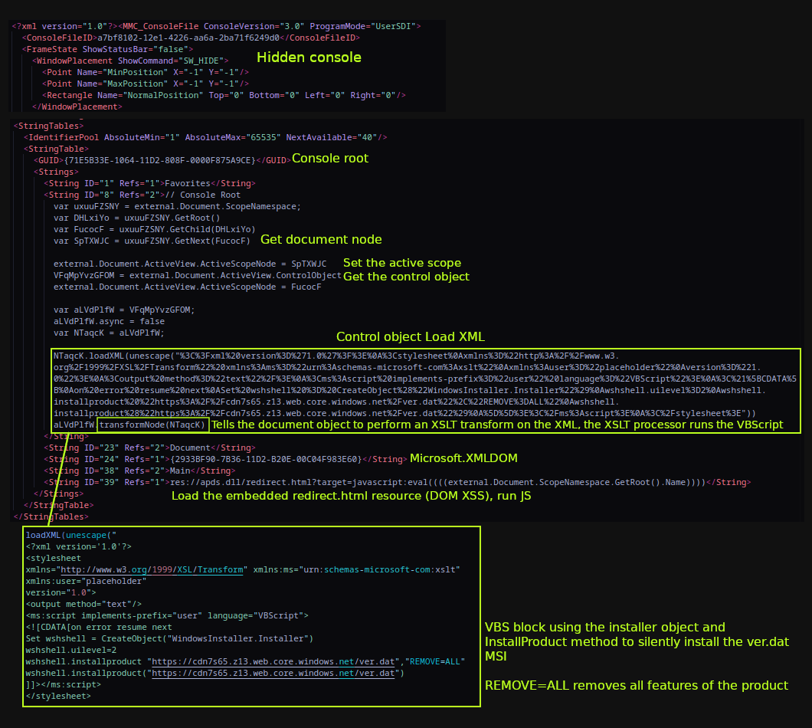
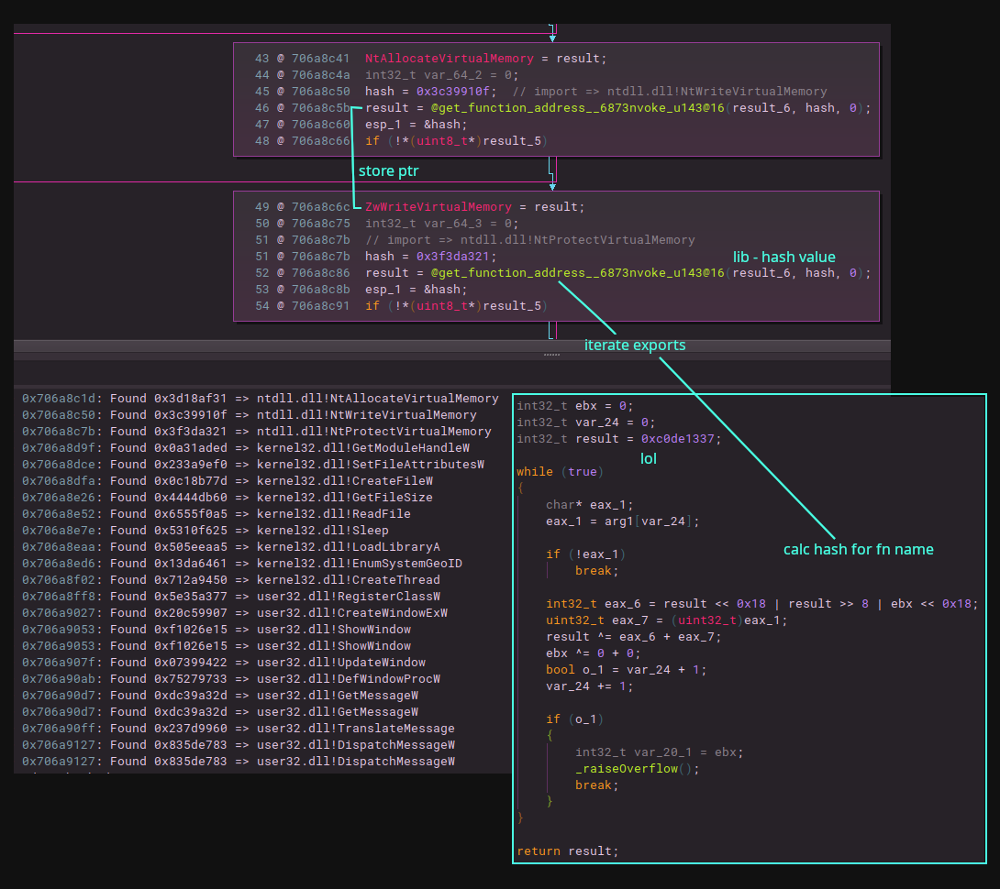
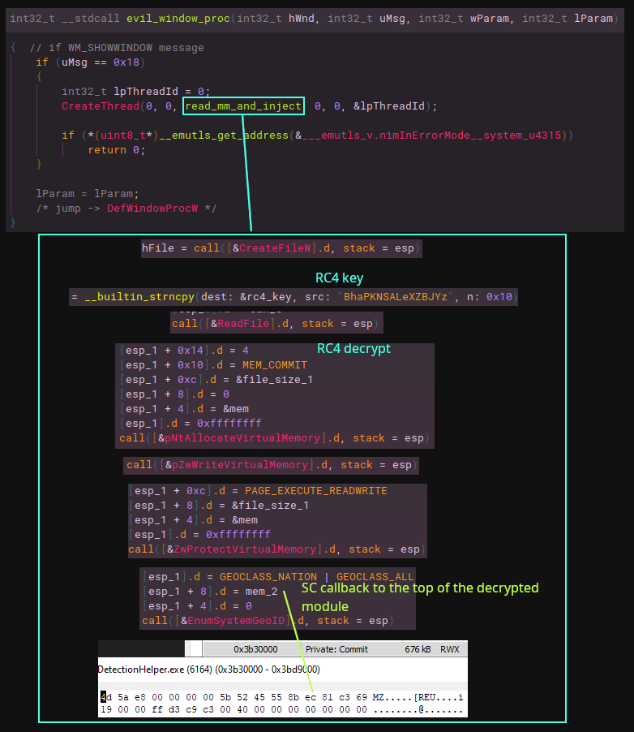
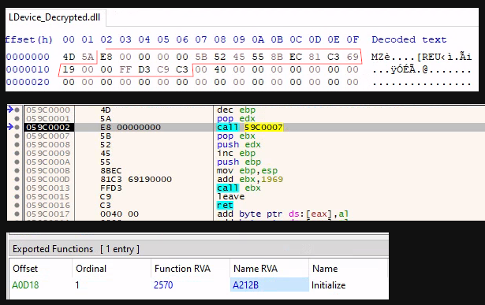
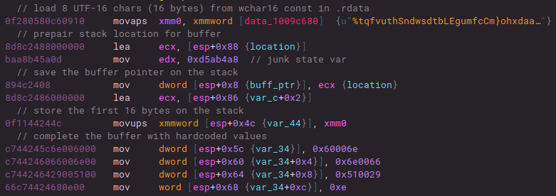
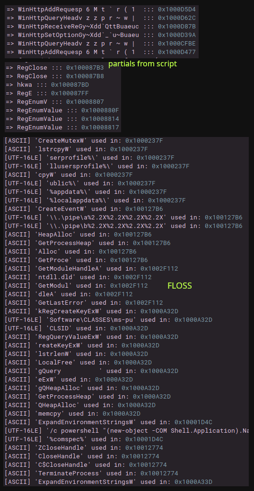
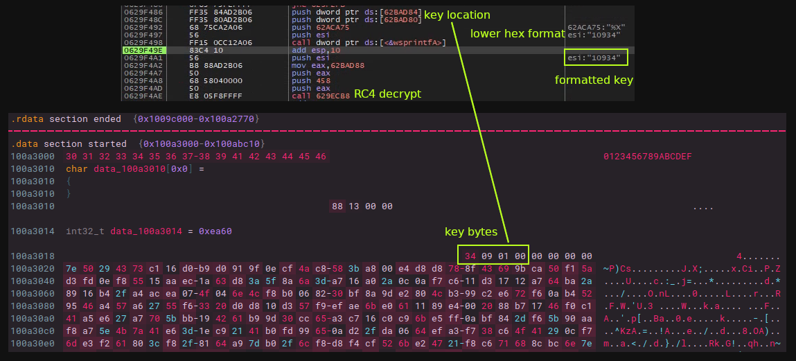
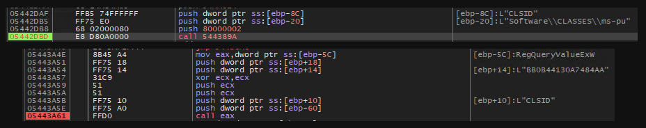

---
layout: post
title: "Zero2Automated February 2025 Challenge: PlugX Analysis"
categories: malware
tags: rat, plugx
--- 

This write up covers my analysis for this month's Zero2Automated bi-monthly malware challenge, posted in the discord. The list of sample files can be found [here](https://github.com/StrikeReady-Inc/samples/tree/main/2024-08-01%20Meeting%20invitation). 

After a quick look up of the file hashes and viewing online sandbox reports, the files appear to be associated with [PlugX/Korplug](https://malpedia.caad.fkie.fraunhofer.de/details/win.plugx) from around mid year 2024. PlugX/Korplug being a modular RAT that's commonly used by Chinese and DPRK APTs for espionage and persistence in compromised systems. Frequently observed in targeted attacks against government agencies, defense contractors, and research institutions. 

## A Grim Resource 
The first stage gets kicked off by a user opening up a downloaded Microsoft Saved Console (MSC) file, which then downloads and starts the next stage (*MSC files are used by the [Microsoft Management Console](https://en.wikipedia.org/wiki/Microsoft_Management_Console) (MMC) for admins to create [consoles](https://learn.microsoft.com/en-us/previous-versions/windows/desktop/mmc/mmc-console-files) where [snap-ins](https://learn.microsoft.com/en-us/previous-versions/windows/desktop/mmc/mmc-snap-ins) can be added/managed, and they are stored on disk in XML format.*)

The MSC config file (dropper) in in this case is leveraging a technique which abuses an old [DOM-based XSS](https://medium.com/@knownsec404team/from-http-domain-to-res-domain-xss-by-using-ie-adobes-pdf-activex-plugin-ba4f082c8199) flaw in `apds.dll` (Authentication Protocol Domain Support) to execute JavaScript in the context of mmc.exe. The MSXML `transformNode` method is used on the document object to perform and XSL transform on the XML, where the XSLTProcessor will run the VBS contained inside. The result is a file named `ver.dat` (MSI file) getting downloaded from `hxxps[://]cdn7s65[.]z13[.]web[.]core[.]windows[.]net/ver[.]dat` and installed via `WindowsInstaller.Installer.InstallProduct` in silent execution (`uilevel=2`). 

An article was put out by [Elastic](https://www.elastic.co/security-labs/grimresource), who discovered new infection techniques with MSC files that they dubbed `GrimResource` (template examples [here](https://github.com/ZERODETECTION/MSC_Dropper/tree/main), and another post by Outflank covering the techniques [here](https://www.outflank.nl/blog/2024/08/13/will-the-real-grimresource-please-stand-up-abusing-the-msc-file-format/)). Before this a post by [Genians](https://www.genians.co.kr/blog/threat_intelligence/facebook) on abuse of MSC files by a DPRK APT, as well as [NTT](https://jp.security.ntt/tech_blog/controlplug) around the same time frame of [DarkPeony](https://lazarus.day/actors/alias/darkpeony) using a similar MSC dropper method to deploy PlugX in operation ControlPlug. 

*Meeting Invitation.msc*


The file is using a PDF icon and later in the execution chain, a dummy PDF with the same name as the MSC file opens up for the user and contains the following message:

```text
*Meeting Topic: Project Milestones Discussion
Date & Time: August 15, 2024, at 10:00 AM EDT
Join Zoom Meeting: https://zoom.us/j/1234567890

Meeting ID: 123 456 7890
Passcode: 987654

Please make sure to have Zoom installed on your device prior to the meeting. You can download Zoom from Zoom's official website if you haven't already.

If you have any questions or need further assistance, please feel free to reach out to me.

Looking forward to your participation.*
```

## Initial Overview
Taking a look at the component and action tables inside the `ver.dat` (MSI file) shows 3 files and a default directory name in local appdata in which they all get dropped to. 

| Action          | Type | Source       | Target                                               |
|-----------------|------|--------------|------------------------------------------------------|
| SetOblsaYFUJOqn | 51   | OblsaYFUJOqn | [%LOCALAPPDATA]\FRKBrMZCk                            |
| WwcslyN         | 2274 | TARGETDIR    | [%LOCALAPPDATA]\FRKBrMZCk\LDeviceDetectionHelper.exe |

| File        | Component_  | FileName                                 | FileSize |
|-------------|-------------|------------------------------------------|----------|
| ihltRPL     | ihltRPL     | LDevice.dat                              | 689342   |
| LiPifemwQsa | LiPifemwQsa | hid.dll                                  | 266266   |
| wiBqETobmg  | wiBqETobmg  | rfmyqt8f.exe\|LDeviceDetectionHelper.exe | 1775384  |

`LDeviceDetectionHelper.exe` is a legitimate [Logitech binary](https://support.logi.com/hc/en-us/articles/360025141274-SetPoint) that's part of Logitech SetPoint software, which is used to customize mouse, keyboard, and touchpad settings etc. Files from the MSI are dropped in the default `FRKBrMZCk` directory and the Logitech binary is run with no command line arguments. The malicious `hid.dll` (Nim loader for the main module) in this directory is then [side loaded](https://hijacklibs.net/entries/microsoft/built-in/hid.html) ([T1574.002](https://attack.mitre.org/techniques/T1574/002/)) by this process and within the export `HidD_GetHidGuid` the main module `LDevice.dat` (encrypted on disk) gets loaded. 

With no command line arguments the process will create a copy of the main module into a hidden `.Logitech` directory, and a copy of the logitech binary and hid.dll into a hidden directory. The location of these and the name of the directory containing the side loading package varies. The process will then drop the decoy PDF in AppData and use the default application for reading PDFs to open it. It then spawns a child LDeviceDetectionHelper process with a 3 digit command line arg (seems random to me every time I launched it and it seems to make no difference on what routines run).

*Locations for file drops on disk*
```text
---- [Locations] ----
%PROGRAMDATA%
%PUBLIC%
%APPDATA%
%LOCALAPPDATA%

---- [Hidden Directories] ----
.Logitech (main module)
SamsungDriver (loader & logitech)
Intelnet (loader & logitech)
SecurityScan (loader & logitech)

```
## Inside hid.dll
Looking at the loaded DLL inside the logitech processes an you can see an `HidD_GetHidGuid` export (same as in the legit hid.dll) and a `NimMain`. Looking at the strings and things like `Winim` and some other Nim libraries are noticeable. Looking through a few of the functions in the `HidD_GetHidGuid` there is one that looks like it resolves imports from hard coded hash values. To resolve these I just parsed the suspected libraries that I though it would be pulling suspicious functions from, calculate and store the hash values in a dictionary, locate the hash values in Binja by scanning each basic block's disassembly for numeric tokens, parse it as an integer and see if it matches an entry in the dictionary. 



*Binja snippet for resolving hash values in hid.dll*
```python
import os
import pefile
from binaryninja import BinaryViewType, InstructionTextTokenType

def rotr32(value, shift):
	value &= 0xffffffff
	return ((value >> shift) | (value << (32 - shift))) & 0xffffffff

def routine(func_name_bytes):
	state = 0xc0de1337 
	for b in func_name_bytes:
		tmp = rotr32(state, 8)
		tmp = (tmp + b) & 0xffffffff
		state = state ^ tmp
	return state & 0xffffffff

def generate_hash_dict(dll_paths):
	hash_dict = {}
	for entry in dll_paths:
		if isinstance(entry, tuple):
			module_name, dll_path = entry
		else:
			dll_path = entry
			module_name = os.path.splitext(os.path.basename(dll_path))[0]
		
		pe = pefile.PE(dll_path)
		for exp in pe.DIRECTORY_ENTRY_EXPORT.symbols:
			if exp.name is None:
				continue
			func_name_bytes = list(exp.name)
			h = routine(func_name_bytes)
			hash_dict[h] = f"{module_name}!{exp.name.decode('ascii', 'ignore')}"
	
	return hash_dict

dll_list = [
	("ntdll.dll", "/home/rb3nzr/Desktop/ntdll.dll"),
	("kernel32.dll", "/home/rb3nzr/Desktop/kernel32.dll"),
	("user32.dll", "/home/rb3nzr/Desktop/user32.dll")
]

hashes = generate_hash_dict(dll_list)

def annotate_hashed_imports():
	for fn in bv.functions:
		for block in fn.basic_blocks:
			for line in block.get_disassembly_text():
				addr = line.address
				for token in line.tokens:
					if token.type in [
						InstructionTextTokenType.IntegerToken,
						InstructionTextTokenType.PossibleAddressToken,
						InstructionTextTokenType.DataSymbolToken
					]:
					
					try:
						imm_val = int(token.text, 0)
					except ValueError:
						pass
					
					if imm_val in hashes:
						comment_str = f"import => {hashes[imm_val]}"
						fn.set_comment_at(addr, comment_str)
						print(f"=> 0x{addr:x}: Found 0x{imm_val:08x} => {hashes[imm_val]}")

annotate_hashed_imports()
```
### Sending Messages
Now with some things marked up and having gone through the main export function a few times in the debugger it was clear that some tomfoolery was happening with GUI windows and a messaging routine (windows and message functions dynamically resolved from the hashes). I opted to create a few hooks for Frida to log the details of these calls (full hooks [here](https://github.com/rb3nzr/MA-Tools/PlugX/window_msg_hooks.js)). I ran the binary with `frida -f <location of the logi binary on disk w/ hid.dll> 401 -l hooks.js` where the 401 is just a random three digit argument (for watching this window/message routine specifically you don't need to pass any args, but it's going to keep popping up that stupid decoy PDF if you don't). 

```javascript
function getWindowText(hWnd) {
    if (hWnd.isNull()) return 'NULL';
    try {
        const fnGetWindowTextW = new NativeFunction(
            Module.getExportByName('user32.dll', 'GetWindowTextW'),
            'int', ['pointer', 'pointer', 'int']
        );
        const buffer = Memory.alloc(512);
        const result = fnGetWindowTextW(hWnd, buffer, 256);
        return result > 0 ? buffer.readUtf16String() : '<no title>';
    } catch(e) {
        return `<error: ${e}>`;
    }
}

Interceptor.attach(Module.getExportByName('user32.dll', 'CreateWindowExW'), {
    onEnter: function (args) {
		log("\n----- [CreateWindowExW] -----");
		if (!hWndParent.isNull()) {
			log(` | hWndParent: ${args[8]} (${getWindowText(args[8])})`);
		}
        log(` | dwExStyle: ${args[0].toInt32().toString(16)}`);
        log(` | lpClassName: ${args[1].isNull() ? 'NULL' : args[1].readUtf16String()}`);
        log(` | lpWindowName: ${args[2].isNull() ? 'NULL' : args[2].readUtf16String()}`);
        log(` | dwStyle: ${args[3].toInt32().toString(16)} -> ${getWindowStyleFlags(args[3].toInt32())}`);
        log(` | X: ${args[4].toInt32()} | Y: ${args[5].toInt32()}`);
        log(` | nWidth: ${args[6].toInt32()} | nHeight: ${args[7].toInt32()}`);
        log(` | hMenu: ${args[9].toString()}`);
        log(` | hInstance: ${args[10].toString()}`);
        log(` | lpParam: ${args[11].toString()}`);
    }
});

Interceptor.attach(Module.getExportByName('user32.dll', 'ShowWindow'), {
    onEnter: function (args) {
        log("\n----- [ShowWindow] -----")
        const cmd = args[1].toInt32();
        log(' | hWnd:', args[0]);
		log(' | nCmdShow:', cmd.toString(16));
    }
});

Interceptor.attach(Module.getExportByName('user32.dll', 'DefWindowProcW'), {
    onEnter: function (args) {
        log("\n----- [DefWindowProcW] -----");
        log(` | hWnd: ${args[0].toString()}`);
        log(` | uMsg: ${getMessageName(args[1].toInt32())}`);
        log(` | wParam: ${args[2].toInt32().toString(16)}`);
        log(` | lParam: ${args[3].toString()}`);
    },
    onLeave: function (retval) {
        log(`Return value: ${retval.toString()}`);
    }
});
```

*Frida output from the first CreateWindowExW hook in hid.dll. The dwStyle of the window matches the one created by the logitech binary*
```text 
----- [CreateWindowExW] -----
 | dwExStyle: WS_EX_NOACTIVATE
 | lpClassName: EDIT
 | lpWindowName: NULL
 | dwStyle: 0xcf0000 -> WS_MAXIMIZEBOX | WS_MINIMIZEBOX | WS_THICKFRAME | WS_EX_LAYERED | WS_DLGFRAME | WS_BORDER | WS_CAPTION
 | X: 16772216 | Y: 0
 | nWidth: 0 | nHeight: 0
 | hMenu: 0x0
 | hInstance: 0xb80000
 | lpParam: 0x0

----- [ShowWindow] -----
 | hWnd: 0xc0388
 | nCmdShow: SW_SHOW

----- [DefWindowProcW] -----
 | hWnd: 0xc0388
 | uMsg: WM_SHOWWINDOW
 | wParam: 0x1
 | lParam: 0x0
Return value: 0x0
```

Something to mention first here is that there is a callback function that is filtering messages, and when a certain windows message is passed to it, it triggers the injection routine of the main module. When `RegisterClass` is called its passed the [WNDCLASS](https://learn.microsoft.com/en-us/windows/win32/api/winuser/ns-winuser-wndclassa?redirectedfrom=MSDN) structure and with in that is a pointer to the [WindowProc](https://learn.microsoft.com/en-us/windows/win32/api/winuser/nf-winuser-createwindowexw) callback, which is a user-defined procedure that processes messages sent to the windows by the OS. In this case the WindowProc will check if the `uMsg` parameter equals the [WM_SHOWWINDOW](https://learn.microsoft.com/en-us/windows/win32/winmsg/wm-showwindow) message and when that message is received will call `CreateThread`. The new thread has an `lpStartAddress` for a function that contains the routines for loading the `LDevice.dat` file into memory, decrypting it with `RC4` (hard-coded key), injecting it and triggering execution with a shellcode callback. Any message that does not equal WM_SHOWWINDOW will call `DefWindowProc`, which handles all default processing. To my understanding, what kicks this off is when `ShowWindow` is called with a nCmdShow of  [SW_SHOW](https://learn.microsoft.com/en-us/windows/win32/api/winuser/nf-winuser-showwindow) , causing the WM_SHOWWINDOW message to be processed by the callback. 

*WindowProc callback gets the right message -> function to read into memory and RC4 decrypt LDevice.dat -> function for injection to reflective load*


`EnumSystemGeoID` is used here as a [shellcode callback](https://www.bordergate.co.uk/callback-shellcode-execution/) to the top of the MS-DOS header of the main module, which will carry execution to the `Initialize` (reflective loader) export function. 



## The Main Module
Functions in this module have a [flattened/obfuscated control flow](https://synthesis.to/2021/03/03/flattening_detection.html), and it's impossible to tell what they do statically. Debugging it is also a pain due to this, and from what I saw there were a fair amount of anti-debug checks and structured exception handling (did not really look into this as using [ScyllaHide](https://github.com/x64dbg/ScyllaHide) worked just fine). I was able to recover the original control flow graph of a handful of smaller functions with an OLLVM deobfuscation/unflattening script, but some functions had multiple state machines and tracking the state was a bit difficult (I ended up junking things up). I won't cover this here as it's a whole separate thing and i'm not very knowledgeable on the subject.

Stack strings are also fairly difficult to deal with  in this sample, as almost every string construction and decoding routine is different from the next, and there is no one function that these are processed by. For each API call, a resolution of the function name goes through one of these processes. There were multiple patterns for buffer construction, however the one I saw the most was either immediate stack stores of hard-coded values or initial XMM loads from constants in .rdata plus stack stores of values afterwards to complete the buffer (small or large API names). There are routine patterns for other strings like registry paths etc., that I did not get to.  



I started to try decoding some of these by using [FLOSS](https://github.com/mandiant/flare-floss), which got a decent handful of decoded strings, but far from anything near the total amount. I was having some issues with the [script](https://github.com/mandiant/flare-floss/blob/master/scripts/render-binja-import-script.py) that generates another script from the FLOSS output to mark up results in Binja, so I created a new one [here](https://github.com/rb3nzr/MA-Tools/blob/main/Binja%20Helpers/floss_to_binja.py). Next I tried to create YARA rules to detect the right positions at the start/end of the construction and decoding routines, with the goal of using qiling to emulate the right locations, but for each success I could only get detections on a few of these routines for each signature set. A common routine pattern found was the one above, so I started testing out a way to locate and decode based on that pattern ([snippet](https://github.com/rb3nzr/MA-Tools/PlugX/partial_stack_strings.py) here). Goal was to find constant stores and XMM loads, and try out a few repeated decoding routines (decode routine in the snippet works for a good amount of API names). Definitely need emulation here (lol).

*Some of the results*


After doing some anti-debug checks, the module will decrypt the config, create/check the mutex `NvSEkVaW` and check/create a legitimate looking run key for `SetPoint Update - (Verified) Logitech`, pointing to the signed logitech binary on disk. After checking command line args, if none, will drop the decoy PDF in local app data, use the default program for PDFs to start it, then start the logitech binary again with a random 3 digit arg and exit. That's really the gist of what happens before setting up for the main communications loop. 

### Config Extraction
After the module is set up in memory it will decrypt the config, which is at the top of the `.data` section, and is RC4 encrypted with the key being the first 4 bytes of the config blob. The key will get formatted by `wsprintfA`, and after that be used to decrypt the config, resulting in the mutex name used, domains, campaign ID (possible, not sure), and the name of the decoy document used. 



*For a static extractor we can take the first four bytes off the top from the start location and format:*
```python
import pefile
from Crypto.Cipher import ARC4

pe = pefile.PE("plugx_mm.dll")
data_section = pe.sections[2]
data = data_section.get_data()

key_bytes = data[24:28]
key = f"{int.from_bytes(key_bytes, 'little'):X}"
print(f">>> DECRYPTION KEY: {key}")

enc_config = data[32:].split(b'\x00\x00', 1)[0]

rc4 = ARC4.new(key.encode())
config = rc4.decrypt(enc_config)

fields = config.split(b'\x00\x00')
fields = [f for f in fields if f]
fields = [f.decode('utf-8', errors='ignore') for f in fields]
print(f">>> Mutex: {fields[1]}")
print(f">>> Domain 1: {fields[4]}")
print(f">>> Domain 2: {fields[5]}")
print(f">>> Domain 3: {fields[6]}")
print(f">>> Document: {fields[3]}")
print(f">>> Possible campaign ID: {fields[2]}")
```

*Result*
```text
>>> DECRYPTION KEY: 10934
>>> Mutex: NvSEkVnaW
>>> Domain 1: conflictaslesson.com
>>> Domain 2: conflictaslesson.com
>>> Domain 3: conflictaslesson.com
>>> Document: Meeting Invitation.pdf
>>> Possible campaign ID: test
```

### Connection Routine
Before starting communication with the C2, the sample will dynamically construct a User-Agent string based on values in the registry:

```text
\SOFTWARE\Microsoft\Windows NT\CurrentVersion
\SOFTWARE\Microsoft\Internet Explorer\Version Vector
\SOFTWARE\Microsoft\Windows\CurrentVersion\Internet Settings\5.0\User Agent\Post Platform

"Mozilla/5.0 (compatible; <IE verison>; <OS version>; <.NET versions used by IE>)"
```

`Software\CLASSES\ms-pu` is used for setting a client fingerprint (I think?), setting a value under the name `CLSID`. This value will be attached to the `If-None-Match` portion of the header, with a random value appended to the front of it. It could be that if this value is not present on the initial request then the C2 could supply some type of other plugin/payload.



`Sec-Fetch-Dest` contains some interesting values, which are different for each request. I could not find where these values are getting constructed from. Possibly system information of some sort.

To view requests and the responses I used Frida again to hook the encrypt/decrypt functions in the bcrypt library. We can see from the response that the C2 sits behind Cloudflare.

```javascript
Interceptor.attach(Module.getExoprtByName('bcrypt.dll', 'BCryptDecrypt'), {
    onEnter: function (args) {
        console.log("\n----- [BCryptDecrypt] -----");

        this.pClearTxt = args[6];
        this.size = args[7];
        if (this.pClearTxt.isNull()) {
            return;
        }
        this.clearTxtSize = this.size.readU64();
    },
    onLeave: function(retval) {
        if (this.clearTxtSize == 0) {
            return;
        }

        try {
            let clearTxt = this.pClearTxt.readCString(this.clearTxtSize);
            if (clearTxt != null) {
                console.log(clearTxt);
            }
        } catch (err) {
            console.log(err);
        }
    }
});

Interceptor.attach(Module.getExoprtByName('bcrypt.dll', 'BCryptEncrypt'), {
    onEnter: function (args) {
        console.log("\n----- [BCryptEncrypt] -----");

        this.pClearTxt = args[1]; 
        this.clearTxtSize = args[2].toInt32();

        if (!this.pClearTxt.isNull() && this.clearTxtSize > 0) {
            try {
                let clearTxt = this.pClearTxt.readCString(this.clearTxtSize);
                console.log(clearTxt);
            } catch (err) {
                console.log(err);
            }
        }
    }
});
```

*Request*
```text
GET / HTTP/1.1
Cache-Control: no-cache
Connection: Keep-Alive
Pragma: no-cache
Accept: */*
If-None-Match: 6A91BB0B44130A7484AA
User-Agent: Mozilla/5.0 (compatible; MSIE 9.0; Windows NT 10.0; .NET4.0C; .NET4.0E)
Sec-Fetch-Dest: 7BI60C98
Sec-Fetch-Site: none
Sec-Fetch-Mode: cors
Host: conflictaslesson.com
```

*Response*
```text
HTTP/1.1 521
Content-Type: text/plain;
charset=UTF-8
Content-Length: 15
Connection: keep-alive
Report-To: {"endpoints":[{"url":"https:\/\/a.nel.cloudflare.com\/report\/v4?s=YQgYQDzip%2BZuEATmXSlgq%2BoE34xtTbZjLp1Mw%2FJ927tPbhHwEcS2zp8ugxtphaJdGwOCOvPoLg9tStCYkvWMSGREPEUU92VdicPkrBc4iH%2F0Zqte4%2BkeHjGxS66dURaa8KOcvfkikg%3D%3D"}],"group":"cf-nel","max_age":604800}
NEL: {"success_fraction":0,"report_to":"cf-nel","max_age":604800}
X-Frame-Options: SAMEORIGIN
Referrer-Policy: same-origin
Cache-Control: private, max-age=0, no-store, no-cache, must-revalidate, post-check=0, pre-check=0
Expires: Thu, 01 Jan 1970 00:00:01 GMT
Server: cloudflare
CF-RAY: 917c3731ecfd5a09-IAD
alt-svc: h3=":443"; ma=86400
server-timing: cfL4;desc="?proto=TCP&rtt=2537&min_rtt=1017&rtt_var=3300&sent=6&recv=6&lost=0&retrans=0&sent_bytes=3312&recv_bytes=627&delivery_rate=2995839&cwnd=98&unsent_bytes=0&cid=6b628fb0f3061241&ts=276&x=0"

error code: 521
```

The sample offered 19 cipher suites, and the server chose `TLS_ECDHE_ECDSA_WITH_AES_128_SHA256`. Because it's behind `Cloudflare` we are just seeing the CDN's certificate for the domain. The cert chain is from `Google Trust Services` for `conflictaslesson[.]com`, then an R4 intermediate, eventually chained up to a root (`GlobalSign Root CA`). 

*JA3(s) digests*
```text 
    {
        "destination_ip": "104.21.80.1",
        "destination_port": 443,
        "ja3_digest": "a0e9f5d64349fb13191bc781f81f42e1"
    },
    {
        "ja3s_digest": "6d6b821affda5de6562d217770a7ead0",
        "source_ip": "104.21.80.1",
        "source_port": 443
    }
```

## Conclusion
The `Meeting Invitation` files and abuse of the MMC are seen in the [DarkPeony](https://hunt.io/blog/darkpeony-certificate-patterns) (DPRK or China, i've seen posts referring to them as under lazarus group as well as labeling as a suspected Chinese group) campaign operation ControlPlug. However the bulk of files from this challenge were seen in a campaign tied to [RedDelta](https://malpedia.caad.fkie.fraunhofer.de/actor/reddelta) targeting various countries in southeast Asia with an adapted PlugX infection chain (the challenge files appear to be one of RedDelta's modified PlugX variants [IOCs match](https://www.recordedfuture.com/research/reddelta-chinese-state-sponsored-group-targets-mongolia-taiwan-southeast-asia)). 

## Rules & IOCs
```text
import "pe"

rule Decrypted_Main_PlugX_Module_2024 {
   meta:
      description = "Detects the decrypted main RAT module on disk"
      author = "rb3nzr"
      hash1 = "d7a4255297c91d26d726dec228379278b393486e6fa8a57b9b7a5176ca52f91e"

   strings:
      $s1 = "cmd.exe /c start \"" fullword wide
      $s2 = "%userprofile%\\" fullword wide
      $s3 = "%localappdata%\\" fullword wide
      $s4 = "operator co_await" fullword ascii
      $s5 = ".data$rs" fullword ascii
      $s6 = "W\\\\.\\*:" fullword wide
      $x1 = "XEDIT" fullword ascii
      $x2 = {30 31 32 33 34 35 36 37 38 39 41 42 43 44 45 46 88 13 00 00 60 ea 00 00 ?? ?? ?? ?? 00 00 00 00}

   condition:
      uint16(0) == 0x5a4d and filesize < 2000KB and
      1 of ($x*) and 2 of them
}

rule RedDelta_Nim_Loader_2024 {
   meta:
      description = "Detects the Nim loader used to load the main PlugX module"
      author = "rb3nzr"
      hash1 = "1a37289c70c78697b85937ae4e1e8a4cebb7972c731aceaef2813e241217f009"

   strings:
      $s1 = "winim" fullword ascii
      $s2 = "WXp.dll" fullword ascii
      $s3 = "@Bcrypt.dll" fullword ascii
      $s4 = "__gthread_mutex_lock" fullword ascii
      $s5 = "@Ws2_32.dll" fullword ascii
      $s6 = "_mutex_impl_init" fullword ascii
      $s7 = "@mlib@sstd@scmdline.nim.c" fullword ascii
      $s8 = "mutex.c" fullword ascii

   condition:
      uint16(0) == 0x5a4d and filesize < 800KB and
      5 of them and pe.exports("HidD_GetHidGuid") and pe.exports("NimMain")
}

rule Encrypted_Main_PlugX_Module_2024 {
   meta:
      description = "Loose rule to potentially detect the encrypted main RAT module on disk"
      author = "rb3nzr"
      hash1 = "37c7bdac64e279dc421de8f8a364db1e9fd1dcca3a6c1d33df890c1da7573e9f"

   strings:
      // Strings relating to the decoy document from this campaign
      $s1 = "004C0069006200720065004F00660066006900630065002000320034002E0032" ascii // hex encoded string 'LibreOffice 24.2' 
      $s2 = "005700720069007400650072" ascii // hex encoded string 'Writer'
      $s3 = "<</Type/FontDescriptor/FontName/BAAAAA+LiberationSerif" fullword ascii
      $s4 = "/Contents 2 0 R>>" fullword ascii
      $s5 = "/OpenAction[1 0 R /XYZ null null 0]" fullword ascii
      $s6 = "/DocChecksum"

   condition:
      uint16(0) == 0x1eb6 and filesize < 2000KB and
      all of them
}
```

- [KQL for MMC launched via suspicious MSC file](https://github.com/FalconForceTeam/FalconFriday/blob/master/Initial%20Access/0xFF-0545-Suspicious_MSC_File_Launched-Win.md)
- `EQL` querys for detection of script execution from the MMC console and a `YARA` rule for finding MSC files using the GrimResource method found from this Elastic [report](https://www.elastic.co/security-labs/grimresource)

## References 
[https://hunt.io/blog/darkpeony-certificate-patterns](https://hunt.io/blog/darkpeony-certificate-patterns)

[https://www.recordedfuture.com/research/reddelta-chinese-state-sponsored-group-targets-mongolia-taiwan-southeast-asia](https://www.recordedfuture.com/research/reddelta-chinese-state-sponsored-group-targets-mongolia-taiwan-southeast-asia)

[https://hijacklibs.net/entries/microsoft/built-in/hid.html](https://hijacklibs.net/entries/microsoft/built-in/hid.html)

[https://jp.security.ntt/tech_blog/controlplug](https://jp.security.ntt/tech_blog/controlplug)

[https://www.elastic.co/security-labs/grimresource](https://www.elastic.co/security-labs/grimresource)

[https://www.outflank.nl/blog/2024/08/13/will-the-real-grimresource-please-stand-up-abusing-the-msc-file-format/](https://www.outflank.nl/blog/2024/08/13/will-the-real-grimresource-please-stand-up-abusing-the-msc-file-format/)

[https://mini-01-s3.vx-underground.org/samples/APTs/2022/2022.09.14%20-%20Dissecting%20PlugX%20to%20Extract%20Its%20Crown%20Jewels/Paper/Dissecting+PlugX+to+Extract+Its+Crown+Jewels.pdf](https://mini-01-s3.vx-underground.org/samples/APTs/2022/2022.09.14%20-%20Dissecting%20PlugX%20to%20Extract%20Its%20Crown%20Jewels/Paper/Dissecting+PlugX+to+Extract+Its+Crown+Jewels.pdf)

[https://mini-01-s3.vx-underground.org/samples/Papers/Malware%20Defense/Malware%20Analysis/2021/2021-06-02%20-%20RedDelta%20PlugX%20Undergoing%20Changes%20and%20Overlapping%20Again%20with%20Mustang%20Panda%20PlugX%20Infrastructure.pdf](https://mini-01-s3.vx-underground.org/samples/Papers/Malware%20Defense/Malware%20Analysis/2021/2021-06-02%20-%20RedDelta%20PlugX%20Undergoing%20Changes%20and%20Overlapping%20Again%20with%20Mustang%20Panda%20PlugX%20Infrastructure.pdf)

[https://mini-01-s3.vx-underground.org/samples/Papers/Malware%20Defense/Malware%20Analysis/2023/2023-12-11%20-%20Mustang%20Panda%E2%80%99s%20PlugX%20new%20variant%20targetting%20Taiwanese%20government%20and%20diplomats.pdf](https://mini-01-s3.vx-underground.org/samples/Papers/Malware%20Defense/Malware%20Analysis/2023/2023-12-11%20-%20Mustang%20Panda%E2%80%99s%20PlugX%20new%20variant%20targetting%20Taiwanese%20government%20and%20diplomats.pdf)

